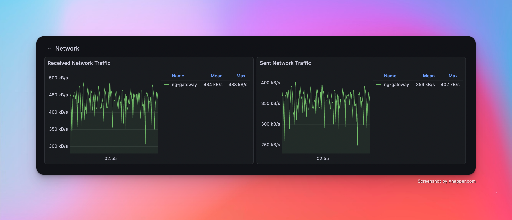
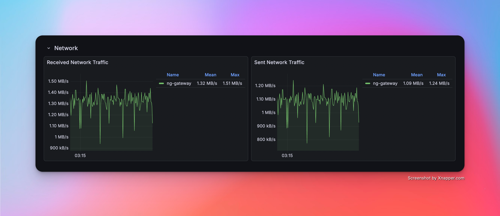
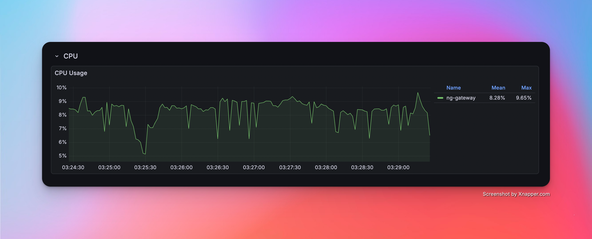
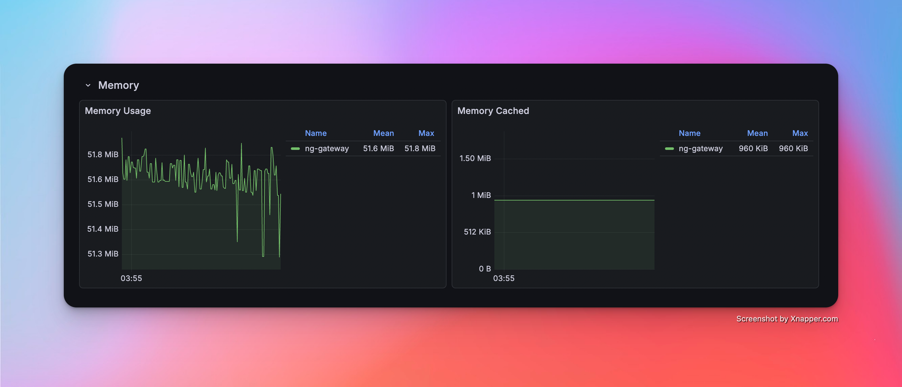
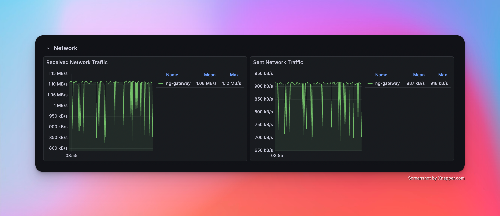

# OPC UA Benchmark

This document records the performance benchmark process and results of `NG Gateway` for the **OPC UA** protocol. The tests run the gateway in a **resource-constrained** Docker container (1 CPU / 1 GB memory), using an external OPC UA simulation server to provide real protocol interaction workloads, and leveraging a **Prometheus + Grafana + cAdvisor** monitoring stack to collect container-level resource metrics in real time, systematically evaluating the gateway as an OPC UA client under different collection scales and frequencies for resource consumption and operational stability.

The tests cover the following dimensions:

- **Collection Scale Gradient**: From a single channel with 10 devices (10,000 points) scaling up to 10 channels with 100 devices (100,000 points)
- **Collection Frequency Comparison**: Standard cycle (1000 ms) vs. high-frequency collection (100 ms)
- **Mixed Workload Stress Test**: Large-scale data collection coMiBined with concurrent random command dispatching

## Test Environment

### Hardware Platform

| Item | Specification |
|---|---|
| CPU | 4 Cores |
| Memory | 24 GB |
| OS | Debian GNU/Linux 12 |

### Gateway Deployment

The gateway is deployed as a `docker compose` container with **resource limits** to simulate a constrained edge-side environment:

| Resource | Limit | Reservation |
|---|---|---|
| CPU | 1.0 Core | 0.5 Core |
| Memory | 1000 MiB | 256 MiB |

::: tip
Resource constraints are configured via Docker Compose `deploy.resources.limits`, consistent with Kubernetes Pod resource quota semantics. See `deploy/compose/bench/docker-compose.yaml` for details.
:::

## Test Tools

### OPC UA Simulation Server

[Prosys OPC UA Simulation Server](https://prosysopc.com/products/opc-ua-simulation-server/) is used as the OPC UA server simulator. Prosys OPC UA Simulation Server is a fully featured free OPC UA simulation tool supporting the OPC UA TCP binary transport protocol. It can simulate various data type nodes (Analog / Discrete / String, etc.), provides flexible address space configuration and data change simulation (sine, random, increment patterns), and is widely used for OPC UA client development debugging and performance verification.

**Simulation Topology:**

| Item | Configuration |
|---|---|
| Server Endpoint | `opc.tcp://<host>:4840` |
| Simulation Node Type | Analog (Float / Double) |
| Data Change Mode | Periodic random updates |

::: tip Mapping Relationship

- Each OPC UA server endpoint maps to a **Channel** in `ng-gateway` — an independent OPC UA session connection
- Each logical node group maps to a **Device** within the channel — collected in batches via the Subscription mechanism for node changes
- Test scenarios create multiple channel connections to the same or different server instances as needed to build different collection workloads

:::

### Performance Monitoring Stack

Resource metrics during testing are collected using the **cAdvisor + Prometheus + Grafana** stack, all orchestrated alongside the gateway container via the same `docker compose` file:

| Component | Version | Role |
|---|---|---|
| [cAdvisor](https://github.com/google/cadvisor) | v0.51.0 | Collects container-level resource metrics: CPU usage, memory (RSS / Cache), network bytes sent/received |
| [Prometheus](https://prometheus.io/) | latest | Scrapes cAdvisor `/metrics` endpoint every **2s**, persists time-series data |
| [Grafana](https://grafana.com/) | latest | Visualization dashboards with pre-configured cAdvisor Docker container monitoring |

**Core Metrics Collected:**

| Metric | Prometheus Metric | Description |
|---|---|---|
| CPU Usage | `container_cpu_usage_seconds_total` | CPU usage percentage per container |
| Memory Usage | `container_memory_rss` | Resident Set Size |
| Network Receive | `container_network_receive_bytes_total` | Total bytes received (rate computed) |
| Network Transmit | `container_network_transmit_bytes_total` | Total bytes transmitted (rate computed) |

**Quick Start:**

```bash
cd deploy/compose/bench && docker compose up -d
```

| Service | Access URL |
|---|---|
| Grafana | http://localhost:3000 (admin / admin) |
| Prometheus | http://localhost:9090 |
| cAdvisor | http://localhost:8080 |
| ng-gateway | http://localhost:8978 |

## Summary

### Data Collection Performance

| Scenario | Channels | Devices/Channel | Points/Device | Frequency | Total Points | Type | Memory | CPU | Network Bandwidth |
|---:|---:|---:|---:|---|---:|---|---|---|---|
| 1 | 1 | 10 | 1,000 | 1000 ms | 10,000 | Float32 | 18.33 MiB | 1.63% | rx: 7 kB/s<br>tx: 7 kB/s |
| 2 | 5 | 10 | 1,000 | 1000 ms | 50,000 | Float32 | (TBD) | (TBD) | (TBD) |
| 3 | 10 | 10 | 1,000 | 1000 ms | 100,000 | Float32 | (TBD) | (TBD) | (TBD) |
| 4 | 1 | 1 | 1,000 | 100 ms | 1,000 | Float32 | (TBD) | (TBD) | (TBD) |
| 5 | 5 | 1 | 1,000 | 100 ms | 5,000 | Float32 | (TBD) | (TBD) | (TBD) |
| 6 | 10 | 1 | 1,000 | 100 ms | 10,000 | Float32 | (TBD) | (TBD) | (TBD) |
| 7 | 10 | 10 | 1,000 | 1000 ms | 100,000 | Float32 | (TBD) | (TBD) | (TBD) |

### Mixed Load Performance (Downlink Latency)

| Scenario | Channels | Devices/Channel | Points/Device | Frequency | Total Points | Type | Downlink Method | Downlink Points | Iterations | Min Latency | Max Latency | Avg Latency |
|---:|---:|---:|---:|---|---:|---|---|---:|---:|---|---|---|
| 7 | 10 | 10 | 1,000 | 1000 ms | 100,000 | Float32 | (TBD) | (TBD) | 100 | (TBD) | (TBD) | (TBD) |

## Test Scenarios & Results

### Scenario 1: Basic Collection

*   **Config**: 1 Channel · 10 Devices · 1,000 Points/Device · 1000 ms Period (Total **10,000** Points)

#### Metrics

| Memory | CPU | Network Bandwidth |
|---|---|---|
| 18.33 MiB | 1.63% | rx: 7 kB/s<br>tx: 7 kB/s |

#### Resource Monitor Screenshots

<!-- TODO: Insert Grafana (CPU/Memory/Network) screenshots for Scenario 1 -->
<!--  -->
<!--  -->
<!--  -->

---

### Scenario 2: Medium Scale Collection

*   **Config**: 5 Channels · 10 Devices · 1,000 Points/Device · 1000 ms Period (Total **50,000** Points)

#### Metrics

| Memory | CPU | Network Bandwidth |
|---|---|---|
| (TBD) | (TBD) | (TBD) |

#### Resource Monitor Screenshots

<!-- TODO: Insert Grafana (CPU/Memory/Network) screenshots for Scenario 2 -->
<!--  -->
<!--  -->
<!--  -->

---

### Scenario 3: Large Scale Collection

*   **Config**: 10 Channels · 10 Devices · 1,000 Points/Device · 1000 ms Period (Total **100,000** Points)

#### Metrics

| Memory | CPU | Network Bandwidth |
|---|---|---|
| (TBD) | (TBD) | (TBD) |

#### Resource Monitor Screenshots

<!-- TODO: Insert Grafana (CPU/Memory/Network) screenshots for Scenario 3 -->
<!--  -->
<!--  -->
<!--  -->

---

### Scenario 4: High Frequency (Single Channel)

*   **Config**: 1 Channel · 1 Device · 1,000 Points/Device · **100 ms** Period (Total **1,000** Points)

#### Metrics

| Memory | CPU | Network Bandwidth |
|---|---|---|
| (TBD) | (TBD) | (TBD) |

#### Resource Monitor Screenshots

<!-- TODO: Insert Grafana (CPU/Memory/Network) screenshots for Scenario 4 -->
<!--  -->
<!--  -->
<!--  -->

---

### Scenario 5: High Frequency (Multi Channel)

*   **Config**: 5 Channels · 1 Device · 1,000 Points/Device · **100 ms** Period (Total **5,000** Points)

#### Metrics

| Memory | CPU | Network Bandwidth |
|---|---|---|
| (TBD) | (TBD) | (TBD) |

#### Resource Monitor Screenshots

<!-- TODO: Insert Grafana (CPU/Memory/Network) screenshots for Scenario 5 -->
<!--  -->
<!--  -->
<!--  -->

---

### Scenario 6: High Frequency (Large Scale)

*   **Config**: 10 Channels · 1 Device · 1,000 Points/Device · **100 ms** Period (Total **10,000** Points)

#### Metrics

| Memory | CPU | Network Bandwidth |
|---|---|---|
| (TBD) | (TBD) | (TBD) |

#### Resource Monitor Screenshots

<!-- TODO: Insert Grafana (CPU/Memory/Network) screenshots for Scenario 6 -->
<!--  -->
<!--  -->
<!--  -->

---

### Scenario 7: Mixed Workload (Collection + Downlink)

*   **Config**: 10 Channels · 10 Devices · 1,000 Points/Device · 1000 ms Period (Total **100,000** Points) + Random Command Dispatching

#### Metrics (Collection)

| Memory | CPU | Network Bandwidth |
|---|---|---|
| (TBD) | (TBD) | (TBD) |

#### Metrics (Downlink)

| Success/Fail | Min Latency | Max Latency | Avg Latency |
|---|---|---|---|
| (TBD) | (TBD) ms | (TBD) ms | (TBD) ms |

#### Resource Monitor Screenshots

<!-- TODO: Insert Grafana (CPU/Memory/Network) screenshots for Scenario 7 -->
<!--  -->
<!--  -->
<!--  -->

