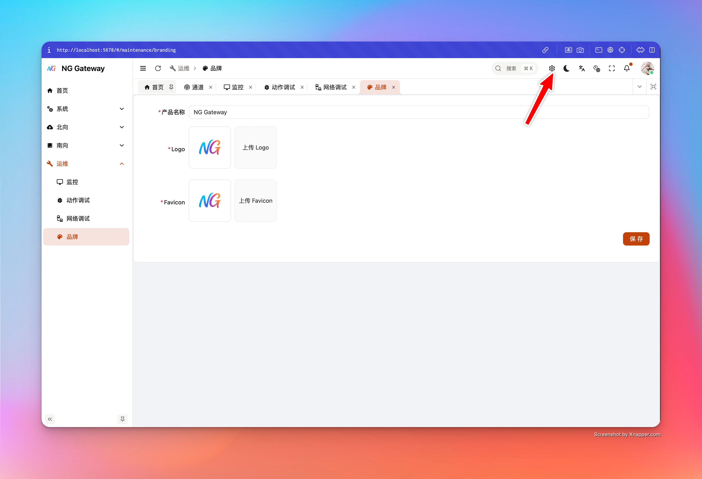
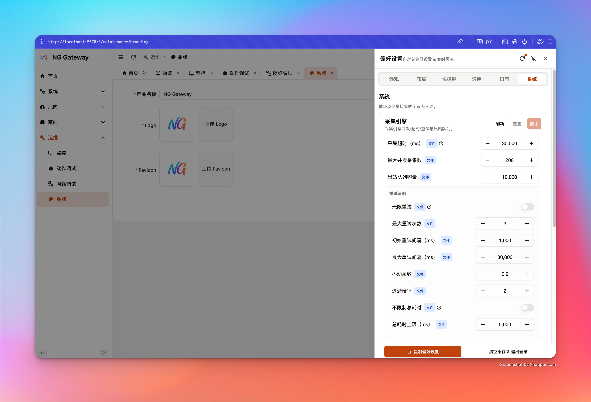
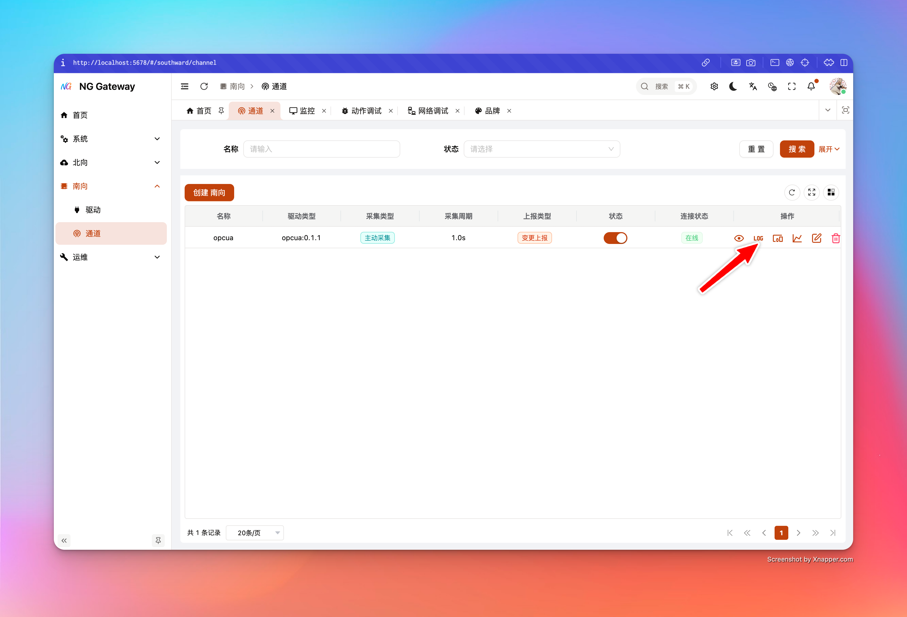
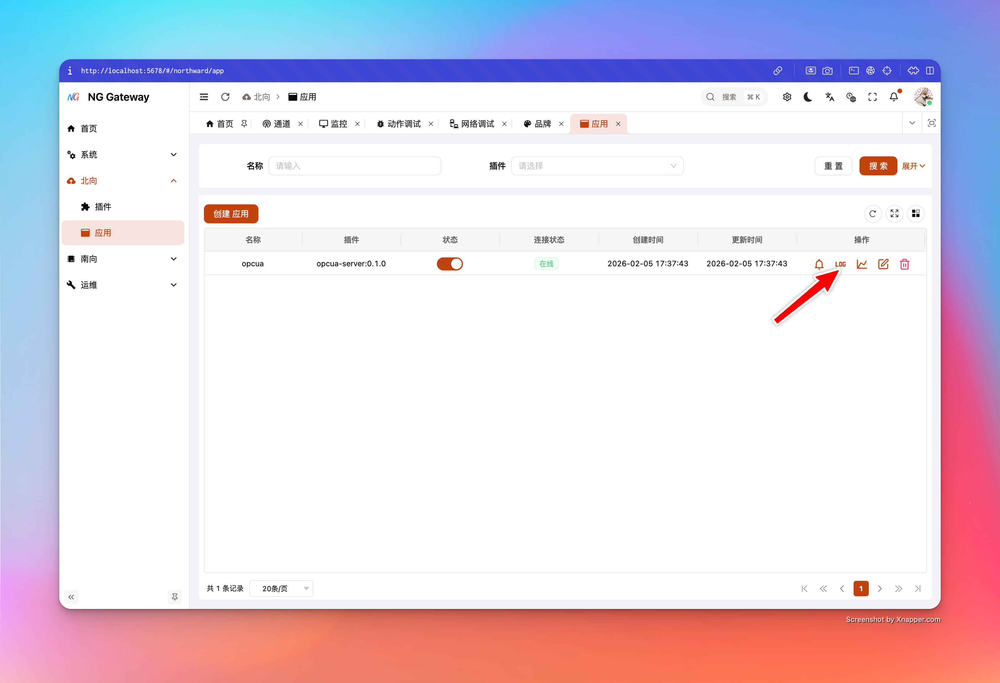

# Configuration Management

This page covers two key "Operable, Governable" capabilities:

-   **System Configuration (Runtime Tuning)**: Adjust running parameters of Collector/Southward/Northward without restarting process (And persist to config file)
-   **Logging System**: Global log level, temporary log level override (per-channel/per-app, with TTL auto-rollback), log output format and disk strategy, file download and cleanup

## 0. Important Design

Each tunable configuration item carries "Source" information:

-   **Default**: System default value
-   **File**: From config file (e.g., `gateway.toml`)
-   **Env**: From environment variable (e.g., `NG__GENERAL__COLLECTOR__COLLECTION_TIMEOUT_MS`)

When a field is overridden by environment variable:

-   UI displays corresponding env key (`envKey`), and sets field to read-only (`envOverridden=true`)
-   This is a **Strong Constraint**: Avoid illusion of "UI looks changed, but actual run still covered by Env"

Best Practice:

-   **K8s/Containerization**: Use Env as "Environment Baseline", UI for "Temporary Tuning/Verification", write back to values/config after confirmation
-   **Bare Metal/Edge Gateway**: Prioritize config file as Single Source of Truth, Env only for sensitive info or temporary override

## 1. System Configuration

System configuration page focuses on core parameters "Affecting Throughput/Latency/Backpressure". Each PATCH returns `ApplySystemSettingsResult`, explicitly telling you:

-   Whether applied (applied)
-   Whether persisted (persisted)
-   Which keys changed (changedKeys)
-   Which keys blocked by Env override (blockedByEnv)
-   Runtime warning (runtimeWarning)
-   Impact semantics (impact): Hot Update / Need Component Restart / Need Process Restart

> Server implements concurrency protection: System settings PATCH is serialized, but won't block other APIs (Avoid UI "Freeze").

### 1.1 Collector (Collection Engine)

Interface:

-   `GET /api/system/settings/collector`
-   `PATCH /api/system/settings/collector`

Key Fields:

-   **collectionTimeoutMs**: Single device collection timeout (ms)
    -   Too small: Easy to misjudge timeout, error rate rises
    -   Too large: Slow device occupies concurrency slot, dragging down overall throughput
-   **maxConcurrentCollections**: Max concurrent collections
    -   Main lever to boost throughput, but increases CPU/Network/Driver concurrency pressure
-   **outboundQueueCapacity**: Bounded queue capacity Collector → Gateway
    -   Too small: Easy backpressure or drops (Depends on drop policy)
    -   Too large: Occupy more memory, and "Backlog" masks downstream slowness
-   **retryPolicy**: Retry and backoff policy
    -   `maxAttempts=null` means unlimited attempts (Use with caution)
    -   `maxElapsedTimeMs=null` means unlimited duration (Use with caution)

Suggested Tuning Process:

1.  Observe Metrics first (Throughput, Queue Depth, Error Rate)
2.  Small step adjustment and observe 5~15 minutes
3.  If `runtimeWarning` appears, judge whether to restart related components per hint

### 1.2 Southward (Southward Runtime)

Interface:

-   `GET /api/system/settings/southward`
-   `PATCH /api/system/settings/southward`

Key Fields (High Impact Items):

-   **startTimeoutMs**: API sync start wait timeout (Driver connection wait)
-   **deviceChangeCacheTtlMs**: Point change baseline cache TTL (`0` means no eviction)
    -   TTL too short: Easier to trigger "Change Judgment" jitter
    -   TTL too long/No eviction: More memory usage, and change baseline may be too old
-   **snapshotGcIntervalMs / snapshotGcWorkers / maxDevicesPerSnapshotTick**
    -   Control snapshot GC scan rhythm and concurrency
    -   Too aggressive increases CPU; too conservative leads to untimely memory reclamation

### 1.3 Northward (Northward Runtime)

Interface:

-   `GET /api/system/settings/northward`
-   `PATCH /api/system/settings/northward`

Key Fields:

-   **queueCapacity**: Northward internal queue capacity
    -   Directly affects northward backpressure and buffering capability
-   **startTimeoutMs**: API sync start wait timeout (App start wait)

## 2. Logging System

Logging system suggests understanding from "Governance Perspective", not "Turn level to DEBUG until visible".

Three layers of capability here:

-   **(A) Global Baseline Log Level**: Long-term effective (baseline)
-   **(B) Temporary Override (TTL override)**: Temporarily raise or lower per Channel/App, auto rollback
-   **(C) Output and File Governance**: Format, Disk write, Rotation, Retention, Cleanup, Download

### 2.1 Global Log Level (baseline)

Interface:

-   `GET /api/system/settings/logging_runtime`
-   `PATCH /api/system/settings/logging_runtime`

Key Fields:

-   **baseline**: Global baseline level you set (UI editable)
-   **effective**: Current effective global level (May differ from baseline)
    -   UI prompts difference when other temporary mechanisms or external controls cause global effective difference

Suggestion:

-   Production default `INFO` (Or `WARN`, depending on troubleshooting needs)
-   `TRACE` only for short-time diagnosis (With TTL, avoid log storm)

### 2.2 Temporary Override: per-channel / per-app Log Level (TTL)

This is a **Product-level** capability: You can temporarily set "A Channel" or "A Northward App" to DEBUG/TRACE for troubleshooting, system auto rolls back after TTL expires, avoiding performance and disk cost of "Permanent DEBUG".

#### per-channel (Channel Log Level)

Interface (Channel Module):

-   `GET /api/channel/{id}/log-level`
-   `PUT /api/channel/{id}/log-level` (body: `{ level, ttlMs }`)
-   `DELETE /api/channel/{id}/log-level`

UI Entry:

-   **Southward → Channel** List → Right Operation Column **"Log Level"** (`mdi:math-log` icon)
-   Popup sets level and TTL, displays countdown progress bar; auto refreshes to "No Override" state upon expiration

Semantic Key Points:

-   TTL has **Unified Guardrails**: `minMs / maxMs / defaultMs`, used to avoid abuse
-   Setting override replaces old override of same scope (Deterministic behavior)
-   Auto invalidates and restores "Follow System" after countdown to 0

#### per-app (Northward App Log Level)

Interface (Northward App Module):

-   `GET /api/northward-app/{id}/log-level`
-   `PUT /api/northward-app/{id}/log-level`
-   `DELETE /api/northward-app/{id}/log-level`

UI Entry:

-   **Northward → App** List → Right Operation Column **"Log Level"** (`mdi:math-log` icon)
-   Interaction consistent with Channel: level + TTL + countdown, auto rollback upon expiration

#### Best Practice: How to Troubleshoot with TTL override

-   **Target One Only**: Prioritize tuning only one channel or one app, avoid log explosion
-   **Short then Long**: Default 5 minutes is enough; extend if necessary
-   **Restore Immediately After Debug**: Do not wait for TTL end (Especially TRACE)

### 2.3 TTL Guardrails and Ingest Queue (Logging Control)

Interface:

-   `GET /api/system/settings/logging_control`
-   `PATCH /api/system/settings/logging_control`

Key Fields:

-   **overrideMinTtlMs / overrideDefaultTtlMs / overrideMaxTtlMs**
    -   Acts on all override scopes (Channel/App/Future extensions)
-   **overrideCleanupIntervalMs**
    -   Override expiration scan interval (Suggest not too small, avoid extra overhead; server lower limit 200ms)
-   **ingestQueueCapacity**
    -   Unified `cdylib -> host` log ingest bounded queue capacity (driver + plugin)
    -   Too small: Easier to appear "New logs can't enter/Drop occurs" during peak
    -   Too large: Occupy more memory, and amplifies log flood caching

### 2.4 Output and Disk (Logging Output)

Interface:

-   `GET /api/system/settings/logging_output`
-   `PATCH /api/system/settings/logging_output`

Configurable Items:

-   **format**: `text` or `json`
-   **includeSpanFields**: Whether to include span context fields in log (Facilitate troubleshooting)
-   **file.enabled / file.dir**: Whether to write to disk, log directory
-   **rotation.mode**: `time` / `size` / `both`
-   **rotation.time**: `hourly` / `daily`
-   **rotation.sizeMb / rotation.maxFiles**
-   **retention.maxDays / retention.maxTotalSizeMb**

Best Practice Suggestion:

-   Production recommend enabling disk write, and setting reasonable **Rotation + Retention**, avoid disk full
-   JSON format suitable for log collection system (ELK/ClickHouse etc.); TEXT more suitable for direct tail

### 2.5 Cleanup and Download (Logging Files & Cleanup)

Interface:

-   `GET /api/system/settings/logging_files`: List log files
-   `POST /api/system/settings/logging_files/download`: Package download (ZIP stream output)
-   `POST /api/system/settings/logging_files/cleanup`: Cleanup by policy (Support dryRun)
-   `GET/PATCH /api/system/settings/logging_cleanup`: Cleanup task switch and cycle

Product-level Security Points (You can write into SOP):

-   Download interface performs security validation on filename, avoiding path traversal
-   Package download uses stream output, prioritizing reduction of large file memory usage
-   Cleanup supports **dryRun**: See "What will be deleted, how much released" first, then delete for real

## 3. Recommended SOP

1.  Open [`Data Monitor`](./data-monitor.md), confirm if device value changing, last update time advancing
2.  If network issue suspected, use [`Net Debug`](./net-debug.md) first:
    -   TCP Port Connectivity → Ping/HTTP
3.  If need to dive into driver/plugin link:
    -   Set log level override for target **Channel or App** (DEBUG, TTL=5min)
4.  Reproduce issue within 5 minute window
5.  Download log package and rollback override (Or wait for TTL auto rollback)
