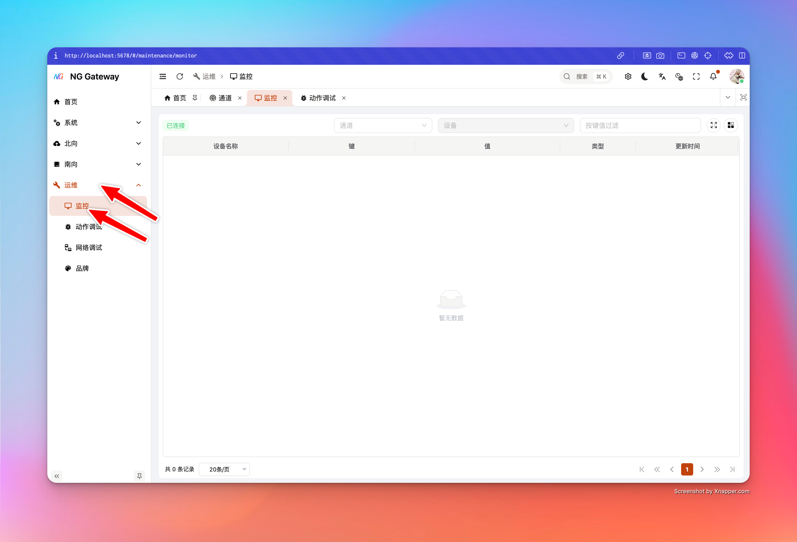

# Data Monitor

"Data Monitor" is used to view **Telemetry** and **Attributes (client/shared/server)** of a device in real-time in the management console, suitable for field troubleshooting and integration verification: You can quickly answer "Is device reporting", "Is value changing", "When was last update".

## Applicable Scenarios

-   **Field Troubleshooting**: Device data intermittent, high latency, suspected data loss, quickly confirm if gateway side has collected latest value
-   **Integration Verification**: Driver/Point mapping just changed, confirm if key is correct, if value changes as expected
-   **Decouple from Northward Link**: Confirm "Collection is normal" first, then check "Cloud upload is normal", avoid guessing both ends

## Telemetry vs Attributes

-   **Telemetry**: Usually represents high-frequency collected/reported time-series data (Point value, sensor data, etc.)
-   **Attributes**: Usually represents relatively static or low-frequency changing attributes
    -   **client**: Attributes reported by device/client side
    -   **shared**: Attributes issued/shared by platform side
    -   **server**: Attributes maintained by server side

In monitor table, `sourceType` identifies whether current row comes from `telemetry` or `attributes`.

## User Guide

1.  **Select Channel**
    -   Used to load device list under this channel, avoid blind selection in large number of devices
2.  **Select Device**
    -   Establish WebSocket connection and subscribe to data stream of this device after selection
3.  **Search by Key**
    -   Input keyword in "Search Box", filter by `key` (Case insensitive)
4.  **View Table Fields**
    -   **Device Name**: Device Name
    -   **Key**: Point key / Attribute key
    -   **Value**: Current value (May be object/array etc. complex JSON)
    -   **Source Type**: `telemetry` or `attributes`
    -   **Last Update**: Last update time of this device (Server timestamp)

## Refresh Semantics and Performance Boundary

To ensure stable usage in "High Throughput + High Frequency Point" scenarios, monitor link implements two layers of "Rate Limit/Merge":

-   **Server-side Merge (200ms Window)**: Server merges point updates of same device within short window before pushing, avoiding UI being flooded by one frame per point
-   **Frontend Throttle (200ms Min Refresh Interval)**: Frontend throttles UI update, avoiding frequent table redraw

In addition, table rendering implements pagination optimization:

-   **Render Current Page Values Only**: Only "Inject realtime value" for current page rows during pagination, controlling refresh cost to \(O(pageSize)\), avoiding browser lag when point quantity is large

## Known Limitations and Notes

-   **Need "Device Snapshot" First**: Monitor depends on latest snapshot of device on gateway side; if device never reported data, may not display any row
    -   Suggest confirming first: Is device connected, collection started, data reported to gateway
-   **Ambiguity of Same Name Attribute Key**: Same key may exist in `client/shared/server` simultaneously, UI internally distinguishes rows by scope (Avoid conflict)

## FAQ

### 1) What if Connection Status shows "Disconnected/Connecting/Reconnecting"?

-   **Check API Gateway Address and Network First**: Can browser access gateway management port
-   **Check Auth Status**: Is login expired (WS may be rejected after expiration)
-   **Check Browser Console**: If WebSocket connection rejected/401/403, usually permission or auth issue

### 2) Selected Device but Table Shows No Data?

-   **Device Has Not Produced Snapshot**: Monitor cannot display key list when device never successfully collected/reported data
-   **Driver/Channel Not Started or Connection Failed**: Check channel connection status and collection status first
-   **Confirm Point Model**: No point configured/No uplink output, telemetry keys will not appear either

### 3) Value Shows `undefined` or Empty?

-   The key may exist in "Metadata List", but current snapshot does not contain value yet (e.g., newly added key, not reported yet)
-   Suggest waiting for next device report or resubscribe (Switch device and switch back)

## Troubleshooting Suggestions

-   **Check Metrics and Backpressure First**: If queue backpressure or drops are obvious, realtime monitor may also have delay
-   **Then Divide Direction**: Is southward collection normal? Is northward upload normal?
