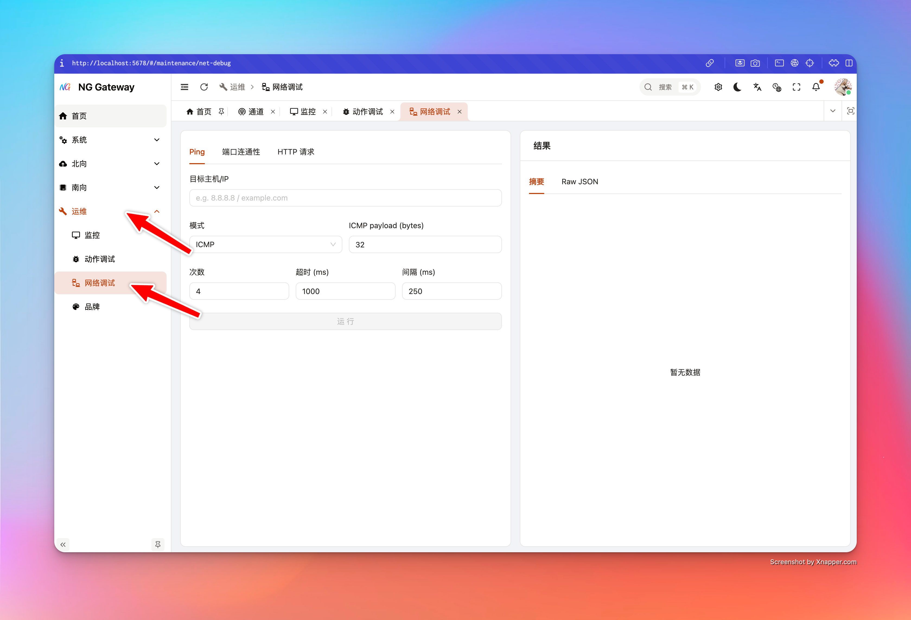
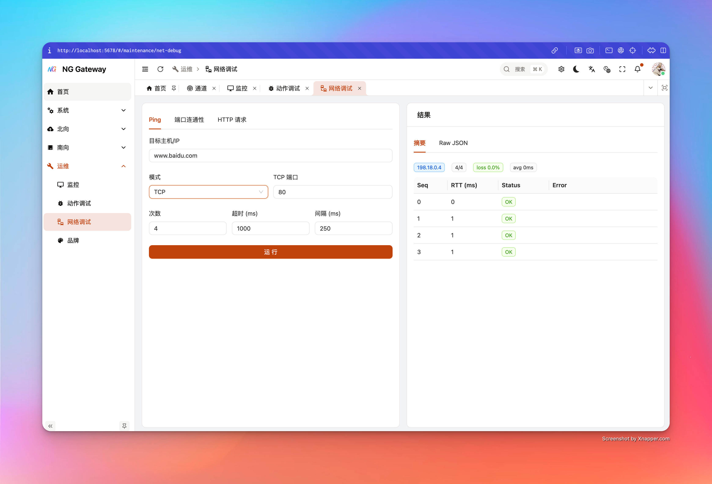
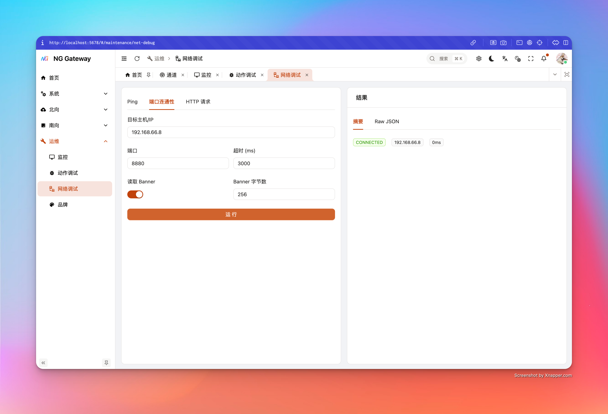

# Net Debug

"Net Debug" provides three built-in diagnostic capabilities: **Ping**, **TCP Connect**, **HTTP Request**. They are all implemented by gateway using library functions, executing no shell commands, avoiding command injection risks, and including minimal SSRF protection (Avoiding turning gateway into intranet scanner).

## 1) Ping (ICMP / TCP)

### What problem it solves

-   Whether target domain resolves to IP (Returns `resolvedIps`)
-   Whether basic network is reachable (Packet loss rate, RTT)
-   When ICMP unavailable, use TCP mode to approximate path reachability

### Parameter Description

-   **Target Host**: Domain or IP
-   **Mode**
    -   `icmp`: ICMP echo
    -   `tcp`: TCP connect to `tcpPort` (For environments without ICMP permission)
-   **ICMP payload (bytes)**: ICMP payload size (8~1024)
-   **Count**: Count (1~20)
-   **Timeout (ms)**: Single timeout (100~30000)
-   **Interval (ms)**: Interval (0~10000)

### Return Result

-   `targetIp`: Target IP used this time (Selected from resolution results)
-   `received/sent` and `lossPercent`
-   `rttAvgMs` (If successful samples exist)
-   `samples[]`: OK/FAIL and RTT/Error for each sequence
-   `note`: Gives hint when common permission issues detected (e.g., Container missing `CAP_NET_RAW`)

### Common Issues

-   **ICMP All Fail and Error contains Permission**: Common in container/restricted environment missing raw socket permission
    -   Solution: Switch to **TCP mode**, or grant `CAP_NET_RAW` to container (Assess security risk)

## 2) TCP Connect (Port Connectivity + Banner)

### What problem it solves

-   Whether TCP connection can be established to target host:port
-   Basic handshake time (`connectMs`)
-   Optional reading Banner (e.g., some services return welcome info/protocol header)

### Parameter Description

-   **Host**: Domain or IP
-   **Port**: Port (1~65535)
-   **Timeout (ms)**: Connection timeout (100~60000)
-   **Read Banner**: Whether to try reading Banner
-   **Banner Bytes**: Read bytes limit (1~4096)

### Return Result

-   `connected`: Whether connection successful
-   `targetIp`: Final successful IP (If multiple resolved, tries one by one)
-   `connectMs`: Connection time
-   `banner`: Read text (If any)
-   `error`: Failure reason (Timeout/Refused/Unreachable etc.)

## 3) HTTP Request (Application Layer Diagnosis)

### What problem it solves

-   Whether target HTTP(S) service is reachable from gateway
-   Status code, response headers, response body (Truncation protection)
-   Redirect behavior, TLS certificate issues (Optional relax)

### Parameter Description

-   **Method**: GET/POST/PUT/PATCH/DELETE/HEAD/OPTIONS
-   **URL**: Only allow `http://` or `https://`
-   **Headers**: Add multiple headers (Empty key ignored)
-   **Body**: Optional request body (Note: Some services inconsistent on GET/HEAD body behavior)
-   **Timeout (ms)**: 200~120000
-   **Max Response Bytes**: Response body limit (1KB~2MB), exceeding truncates and marks `bodyTruncated=true`
-   **Follow Redirects**: Whether to follow redirects (Max 5)
-   **Insecure TLS**: Whether to accept invalid certificate (Diagnostic only, not recommended for production)

### Return Result

-   `status`: HTTP status code (May be empty on failure)
-   `totalMs`: Total time
-   `headers`: Response header map
-   `body`: Response body (May be empty)
-   `bodyTruncated`: Whether truncated
-   `error`: Error info (DNS/TLS/Timeout/Connection Failed etc.)

