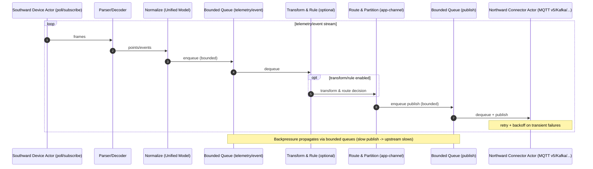
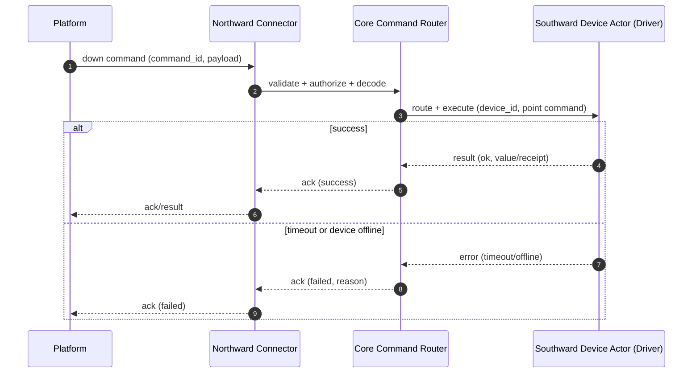
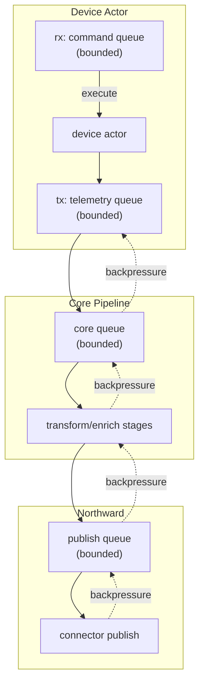

# Architecture Overview

NG Gateway is a high-performance IoT gateway designed for **Industrial/Edge scenarios**: It transports high-frequency data collected from southward device protocols through a **Unified Data Model + Controllable Backpressure Event Pipeline** to northward channels, and evolves continuously in a pluggable manner.

<a id="rust-core"></a>

## Rust High-Performance Core

The core runtime is based on the `tokio` asynchronous model. To achieve "High Concurrency + High Throughput + Controllable Resources" simultaneously, we follow these architectural paradigms:

-   **Fault Isolation**: Tasks are split by device/channel/plugin granularity to avoid single-point anomaly diffusion.
-   **Backpressure First**: All critical event streams use **Bounded Queues**, turning "slow" from implicit accumulation into explicit controllability.
-   **Structured Concurrency**: Tasks have clear parent-child relationships, and `stop`/`reload` have clean and unified cancellation paths and timeout limits.

<a id="overview"></a>

## Understanding NG Gateway in One Diagram

> Tip: This is a logical view (not a physical deployment diagram). Actual deployment can be single-machine, containerized, or Kubernetes clustered.

```text
┌───────────────────────────────────────────────────────────────────────┐
│                              NG Gateway                               │
│                                                                       │
│  ┌───────────────┐    ┌───────────────────────┐    ┌────────────────┐ │
│  │   Southward   │    │   Core Pipeline       │    │   Northward    │ │
│  │  Drivers/IO   │───▶│  (async + backpressure│───▶│  Connectors    │ │
│  │  Modbus/S7/...│    │   + transform)        │    │  MQTT/Opcua/...│ │
│  └───────▲───────┘    └───────────▲───────────┘    └───────▲────────┘ │
│          │                        │                        │          │
│          │                        │                        │          │
│   ┌──────┴──────┐        ┌────────┴────────┐       ┌───────┴───────┐  │
│   │  Device/    │        │  Data Model     │       │  Plugins      │  │
│   │  Driver Conf│        │  & Events       │       │  Enrichment   │  │
│   └─────────────┘        └─────────────────┘       └───────────────┘  │
│                                                                       │
│  Observability (tracing/metrics)  |  Security (TLS/AuthZ)  | Storage  │
└───────────────────────────────────────────────────────────────────────┘
```

<a id="design-goals"></a>

## Design Goals & Key Trade-offs

NG Gateway faces the real industrial field of "**Small Packets, High Frequency + Multi-Protocol Coexistence**", which determines architectural priorities:

-   **Throughput & Stability First**: All critical links must withstand peak loads; the system must protect itself when external dependencies are unstable.
-   **Extensible Without Losing Control**: Supports runtime hot-plugging of drivers/plugins, on-demand enabling, and independent configuration, but the core path remains observable, tunable, and recyclable.
-   **Unified Semantics & Data Model**: Avoid "one model per protocol", ensuring northward integration and business rules can be reused.
-   **Operations Friendly**: Locatable, replayable, rollback-able; key metrics are measurable; error information has context.

<a id="planes"></a>

## Two Planes: Data Plane & Control Plane

Architecturally, two planes are explicitly distinguished (this significantly reduces complexity):

-   **Data Plane**: Southward Acquisition → Normalization → Transformation/Routing → Northward Delivery (High Frequency, Throughput Sensitive)
-   **Control Plane**: Configuration/Command/Lifecycle Management (Low Frequency, Strong Consistency/Auditability more important)

### Data Plane



### Control Plane



<a id="queues"></a>

## Queues & Backpressure Design: Bounded is Not "A Switch", But an Architecture

For backpressure to "truly work", bounded queues must be placed at critical boundaries, with clear strategies for when they are full (Block/Drop/Degrade):



::: tip
Key Point: Backpressure strategies must match business semantics. Not all messages are worth "infinite retries".
:::

<a id="dataflow"></a>

## Data Flow & Backpressure: From Southward to Northward

From a data perspective, the gateway should be a clear, observable, backpressure-capable pipeline:

```text
  → Southward (drivers)
  → Normalize (unified model)
  → Transform/Enrich (optional stages)
  → Route (topic/app/channel)
  → Northward (plugins)
```

The key point is **How Backpressure Propagates**:

-   Northward slows down → publish queue fills up → core queue fills up → Southward acquisition throttles/backs off → System overall stability
-   No link should silently pile data into an unbounded cache (this shifts risk to OOM)

<a id="failure-semantics"></a>

## Failure Semantics: A Stable System Must First Define "How to Handle Failure"

| Failure Point | Typical Cause | Recommended Default Action | Configurable Items to Expose |
| :--- | :--- | :--- | :--- |
| Southward Read Timeout | Device busy/Line jitter | Finite retries + Backoff | `timeout`, `retries`, `backoff` |
| Southward Parse Failure | Noise/Partial Packet/CRC | Drop bad frame + Resync | `max_frame_size`, `resync` |
| Northward Publish Failure | Network disconnect/Auth/Rate limit | Retry + Backoff; Degrade if necessary | `retries`, `backoff`, `buffer_policy` |
| Queue Full | Downstream slows down | Trigger backpressure; or drop by semantics | `queue_capacity`, `drop_policy` |
| Downlink Command Timeout | Device unresponsive | Return explicit failure (retryable) | `command_timeout`, `idempotency` |

::: tip Best Practice
Make "Failure Semantics" part of the configuration schema, and visualize them in metrics (retry counts, drop counts, blocking time).
:::

## Plugin-based Extension

-   **Southward Driver**: Oriented to field protocols, responsible for acquisition and parsing.
-   **Northward Plugin**: Oriented to platform protocols/SDKs, responsible for reporting and control dispatch.

The value of plugin-based architecture is not just "hot-plugging", but **Isolating Changes & Risk Control**:

-   Adding platform integration does not affect the core acquisition link.
-   Adding a protocol driver only affects the IO tasks and parsers of the corresponding devices.
-   Enable on demand, reducing attack surface and resource consumption.

---
