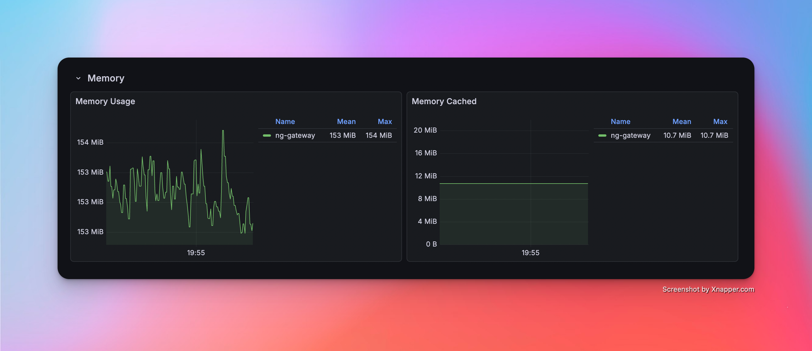
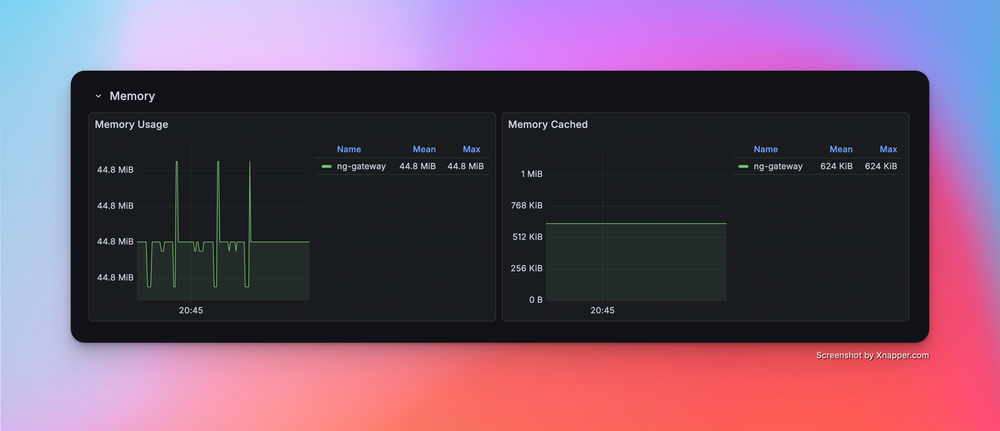
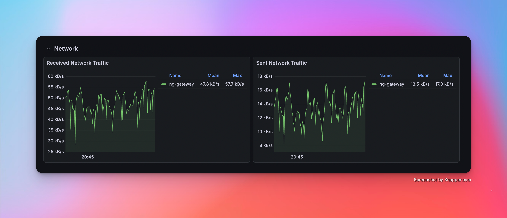
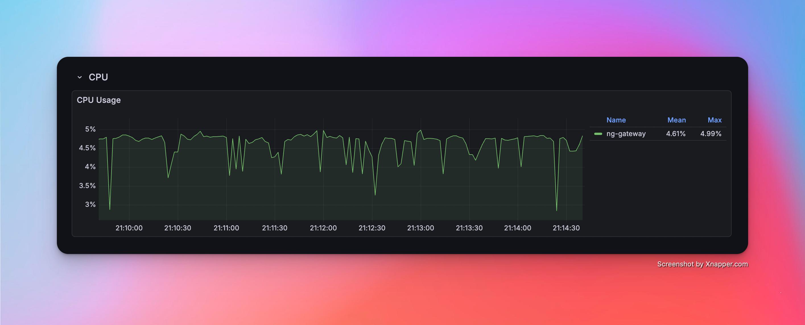
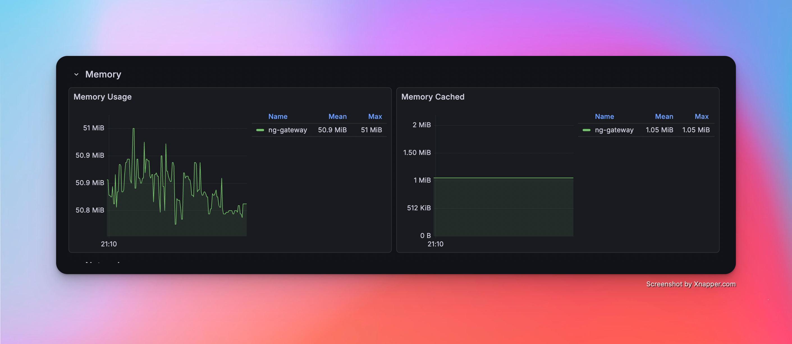
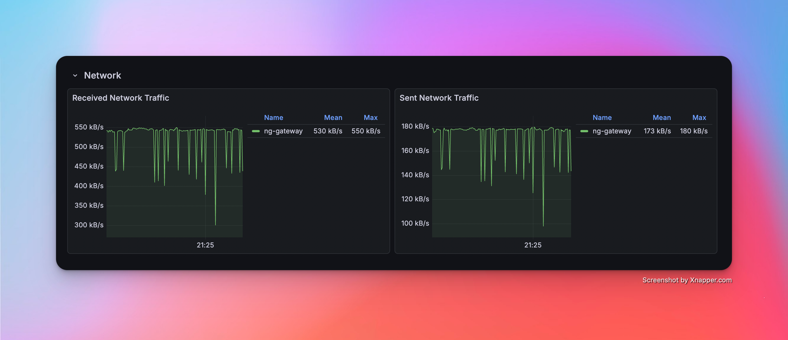

# Modbus 性能基准测试

本文记录 `NG Gateway` 对 **Modbus TCP** 协议的性能基准测试过程与结果。测试在**资源受限**的 Docker 容器中运行网关（1 CPU / 1 GB 内存），使用外部 Modbus 从站模拟器提供真实协议交互负载，并通过 **Prometheus + Grafana + cAdvisor** 监控栈实时采集容器级资源指标，系统性评估网关在不同采集规模与频率下的资源占用和运行稳定性。

测试覆盖以下维度：

- **采集规模梯度**：从单通道 10 设备（10,000 点位）逐步扩展至 10 通道 100 设备（100,000 点位）
- **采集频率对比**：标准周期（1000 ms）与高频采集（100 ms）
- **混合负载压测**：大规模数据采集与随机指令下发并发执行

## 测试环境

### 硬件平台

| 项目 | 规格 |
|---|---|
| CPU | 4 核 |
| 内存 | 24 GB |
| 操作系统 | Debian GNU/Linux 12 |

### 网关部署

网关以 `docker compose` 容器方式部署，并设置**资源上限**以模拟边缘侧受限运行环境：

| 资源 | 限制（Limit） | 预留（Reservation） |
|---|---|---|
| CPU | 1.0 核 | 0.5 核 |
| 内存 | 1000 MiB | 256 MiB |

::: tip
资源约束通过 Docker Compose `deploy.resources.limits` 配置，与 Kubernetes Pod 资源配额语义一致。
:::

::: details docker-compose.yaml

```yaml
services:
  gateway:
    image: ${GATEWAY_IMAGE:-shiyuecamus/ng-gateway}:${GATEWAY_TAG:-latest}
    container_name: ng-gateway
    restart: unless-stopped
    ports:
      - "${GATEWAY_HTTP_PORT:-8978}:5678"
      - "${GATEWAY_WS_PORT:-8979}:5679"
    volumes:
      - gateway-data:/app/data
      - gateway-drivers:/app/drivers/custom
      - gateway-plugins:/app/plugins/custom
    deploy:
      resources:
        limits:
          cpus: "${BENCH_CPU_LIMIT:-1.0}"
          memory: "${BENCH_MEM_LIMIT:-1000M}"
        reservations:
          cpus: "${BENCH_CPU_RESERVE:-0.5}"
          memory: "${BENCH_MEM_RESERVE:-256M}"

  cadvisor:
    image: gcr.io/cadvisor/cadvisor:v0.51.0
    container_name: ng-cadvisor
    restart: unless-stopped
    ports:
      - "8080:8080"
    command:
      - --docker_only=true
      - --housekeeping_interval=2s
      - --store_container_labels=true
    volumes:
      - /:/rootfs:ro
      - /var/run:/var/run:ro
      - /var/run/docker.sock:/var/run/docker.sock:rw
      - /sys:/sys:ro
      - /sys/fs/cgroup:/sys/fs/cgroup:ro
      - /var/lib/docker/:/var/lib/docker:ro
      - /dev/disk/:/dev/disk:ro
    privileged: true
    devices:
      - /dev/kmsg:/dev/kmsg

  prometheus:
    image: prom/prometheus:latest
    container_name: ng-prometheus
    restart: unless-stopped
    ports:
      - "9090:9090"
    volumes:
      - ./prometheus/prometheus.yml:/etc/prometheus/prometheus.yml:ro
      - ng-prometheus-data:/prometheus
    command:
      - --config.file=/etc/prometheus/prometheus.yml
      - --storage.tsdb.path=/prometheus
      - --web.enable-lifecycle
    depends_on:
      - cadvisor
      - gateway

  grafana:
    image: grafana/grafana:latest
    container_name: ng-grafana
    restart: unless-stopped
    ports:
      - "3000:3000"
    environment:
      GF_SECURITY_ADMIN_USER: admin
      GF_SECURITY_ADMIN_PASSWORD: admin
      GF_USERS_ALLOW_SIGN_UP: "false"
      GF_PATHS_PROVISIONING: /etc/grafana/provisioning
    volumes:
      - ./grafana/provisioning:/etc/grafana/provisioning:ro
      - ./grafana/dashboards:/var/lib/grafana/dashboards:ro
      - ng-grafana-data:/var/lib/grafana
    depends_on:
      - prometheus

volumes:
  ng-prometheus-data:
  ng-grafana-data:
  gateway-data:
  gateway-drivers:
  gateway-plugins:
```

:::

## 测试工具

### Modbus 从站模拟器

使用 [Modbus Slave](https://www.modbustools.com/download.html)（Witte Software 出品）作为 Modbus TCP 从站模拟器。Modbus Slave 是一款广泛应用于工业自动化领域的商业级仿真工具，支持 Modbus TCP / RTU / ASCII 协议，能够同时模拟多个独立的从站实例，并提供灵活的寄存器类型配置、数据自动递增和随机化等仿真能力，适用于驱动开发调试与性能压测场景。

**模拟拓扑配置：**

| 项目 | 配置 |
|---|---|
| 独立 TCP 连接数 | 10 个（监听端口 500 ~ 509） |
| 每连接从站数 | 10 个（Slave ID 1 ~ 10） |
| 模拟从站总数 | **100 个** |

::: tip 映射关系说明

- 每个 TCP 端口对应 `ng-gateway` 中的一个**采集通道（Channel）** — 即一条独立的 Modbus TCP 连接
- 每个 Slave ID 对应通道内的一个**采集设备（Device）** — 通过功能码轮询不同从站地址
- 测试场景按需连接部分或全部端口，以构建从 10,000 到 100,000 点位的不同规模采集负载

:::

### 性能监控栈

测试期间的资源指标采集采用 **cAdvisor + Prometheus + Grafana** 组合，整套监控栈与网关容器通过同一 `docker compose` 文件统一编排：

| 组件 | 版本 | 职责 |
|---|---|---|
| [cAdvisor](https://github.com/google/cadvisor) | v0.51.0 | 采集容器级资源指标：CPU 使用率、内存（RSS / Cache）、网络收发字节数 |
| [Prometheus](https://prometheus.io/) | latest | 每 **2s** 抓取 cAdvisor `/metrics` 端点，持久化时序数据 |
| [Grafana](https://grafana.com/) | latest | 可视化面板，预配置 cAdvisor Docker 容器监控仪表盘 |

**采集的核心指标：**

| 指标 | Prometheus Metric | 说明 |
|---|---|---|
| CPU 使用率 | `container_cpu_usage_seconds_total` | 按容器维度计算 CPU 使用百分比 |
| 内存占用 | `container_memory_rss` | 常驻内存集（Resident Set Size） |
| 网络接收 | `container_network_receive_bytes_total` | 容器网络接收字节总量（计算速率） |
| 网络发送 | `container_network_transmit_bytes_total` | 容器网络发送字节总量（计算速率） |

**快速启动：**

```bash
cd deploy/compose/bench && docker compose up -d
```

| 服务 | 访问地址 |
|---|---|
| Grafana | http://localhost:3000（admin / admin） |
| Prometheus | http://localhost:9090 |
| cAdvisor | http://localhost:8080 |
| ng-gateway | http://localhost:8978 |

## 结果汇总

### 数据采集性能表

| 场景 | 通道数 | 设备数/通道 | 点位数/设备 | 采集频率 | 总计点位 | 点位类型 | 内存 | CPU | 网络带宽消耗 |
|---:|---:|---:|---:|---|---:|---|---|---|---|
| 1 | 1 | 10 | 1,000 | 1000 ms | 10,000 | Float32 | 50.8 MiB | 2.62% | rx: 55.2 kB/s<br>tx: 14 kB/s |
| 2 | 5 | 10 | 1,000 | 1000 ms | 50,000 | Float32 | 103 MiB | 4.41% | rx: 269.0 kB/s<br>tx: 72.0 kB/s |
| 3 | 10 | 10 | 1,000 | 1000 ms | 100,000 | Float32 | 153 MiB | 7.03% | rx: 542.0 kB/s<br>tx: 144.0 kB/s |
| 4 | 1 | 1 | 1,000 | 100 ms | 1,000 | Float32 | 44.8 MiB | 2.60% | rx: 47.8 kB/s<br>tx: 13.5 kB/s |
| 5 | 5 | 1 | 1,000 | 100 ms | 5,000 | Float32 | 50.9 MiB | 4.61% | rx: 265.0 kB/s<br>tx: 87.3 kB/s |
| 6 | 10 | 1 | 1,000 | 100 ms | 10,000 | Float32 | 55.2 MiB | 7.56% | rx: 530.0 kB/s<br>tx: 173.0 kB/s |
| 7 | 10 | 10 | 1,000 | 1000 ms | 100,000 | Float32 | 153 MiB | 7.03% | rx: 542.0 kB/s<br>tx: 144.0 kB/s |

### 混合负载性能表

| 场景 | 通道数 | 设备数/通道 | 点位数/设备 | 采集频率 | 总计点位 | 点位类型 | 下发方式 | 下发点位数 | 测试次数 | 最小响应时间 | 最大响应时间 | 平均响应时间 |
|---:|---:|---:|---:|---|---:|---|---|---:|---:|---|---|---|
| 7 | 10 | 10 | 1,000 | 1000 ms | 100,000 | Float32 | API | 100 | 100 | 14.572 ms | 536.517 ms | 75.600 ms |

## 测试场景与结果详情

### 场景 1：基础采集

*   **配置**：1 通道 · 10 设备 · 1,000 点位/设备 · 1000 ms 周期（总计 **10,000** 点位）

#### 性能指标

| 内存 | CPU | 网络带宽消耗 |
|---|---|---|
| 50.8 MiB | 2.62% | rx: 55.2 kB/s<br>tx: 14 kB/s |

#### 资源监控截图


---

### 场景 2：中等规模采集

*   **配置**：5 通道 · 10 设备 · 1,000 点位/设备 · 1000 ms 周期（总计 **50,000** 点位）

#### 性能指标

| 内存 | CPU | 网络带宽消耗 |
|---|---|---|
| 103 MiB | 4.41% | rx: 269.0 kB/s<br>tx: 72.0 kB/s |

#### 资源监控截图


---

### 场景 3：大规模采集

*   **配置**：10 通道 · 10 设备 · 1,000 点位/设备 · 1000 ms 周期（总计 **100,000** 点位）

#### 性能指标

| 内存 | CPU | 网络带宽消耗 |
|---|---|---|
| 153 MiB | 7.03% | rx: 542.0 kB/s<br>tx: 144.0 kB/s |

#### 资源监控截图





---

### 场景 4：高频采集（单通道）

*   **配置**：1 通道 · 1 设备 · 1,000 点位/设备 · **100 ms** 周期（总计 **1,000** 点位）

#### 性能指标

| 内存 | CPU | 网络带宽消耗 |
|---|---|---|
| 44.8 MiB | 2.60% | rx: 47.8 kB/s<br>tx: 13.5 kB/s |

#### 资源监控截图





---

### 场景 5：高频采集（多通道）

*   **配置**：5 通道 · 1 设备 · 1,000 点位/设备 · **100 ms** 周期（总计 **5,000** 点位）

#### 性能指标

| 内存 | CPU | 网络带宽消耗 |
|---|---|---|
| 50.9 MiB | 4.61% | rx: 265.0 kB/s<br>tx: 87.3 kB/s |

#### 资源监控截图





---

### 场景 6：高频采集（大规模）

*   **配置**：10 通道 · 1 设备 · 1,000 点位/设备 · **100 ms** 周期（总计 **10,000** 点位）

#### 性能指标

| 内存 | CPU | 网络带宽消耗 |
|---|---|---|
| 55.2 Mib | 7.56% | rx: 530.0 kB/s<br>tx: 173.0 kB/s |

#### 资源监控截图




---

### 场景 7：混合负载（采集 + 下发）

*   **配置**：10 通道 · 10 设备 · 1,000 点位/设备 · 1000 ms 周期（总计 **100,000** 点位）+ 随机指令下发

#### 性能指标（采集）

| 内存 | CPU | 网络带宽消耗 |
|---|---|---|
| 153 MiB | 7.03% | rx: 542.0 kB/s<br>tx: 144.0 kB/s |

#### 性能指标（下发）

| 成功/失败 | 最小延迟 | 最大延迟 | 平均延迟 |
|---|---|---|---|
| 100 / 0 | 14.572 ms | 536.517 ms | 75.600 ms |

#### 资源监控截图


