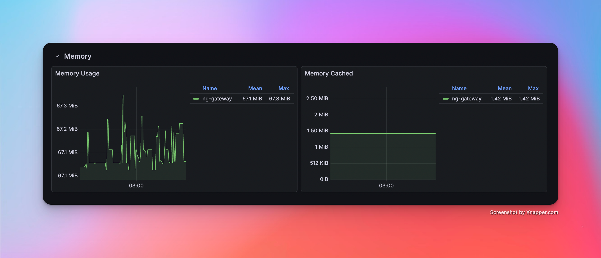
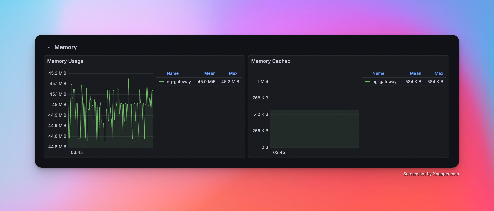
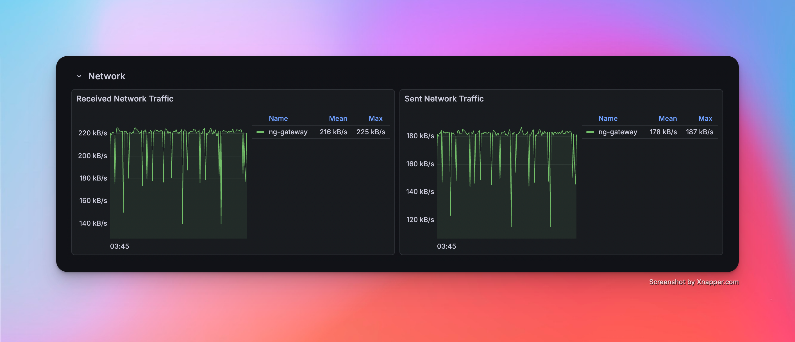
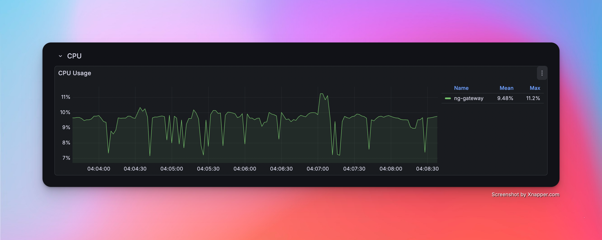
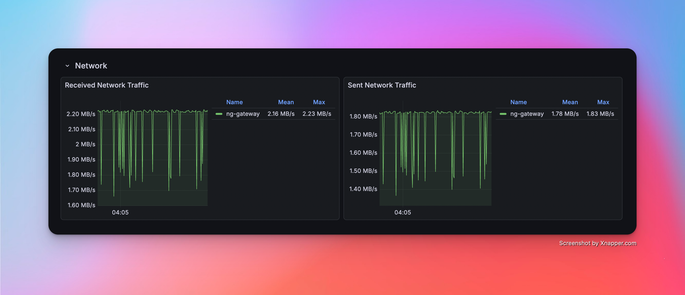

# OPC UA 性能基准测试

本文记录 `NG Gateway` 对 **OPC UA** 协议的性能基准测试过程与结果。测试在**资源受限**的 Docker 容器中运行网关（1 CPU / 1 GB 内存），使用外部 OPC UA 仿真服务器提供真实协议交互负载，并通过 **Prometheus + Grafana + cAdvisor** 监控栈实时采集容器级资源指标，系统性评估网关作为 OPC UA 客户端在不同采集规模与频率下的资源占用和运行稳定性。

测试覆盖以下维度：

- **采集规模梯度**：从单通道 10 设备（10,000 点位）逐步扩展至 10 通道 100 设备（100,000 点位）
- **采集频率对比**：标准周期（1000 ms）与高频采集（100 ms）
- **混合负载压测**：大规模数据采集与随机指令下发并发执行

## 测试环境

### 硬件平台

| 项目 | 规格 |
|---|---|
| CPU | 4 核 |
| 内存 | 24 GB |
| 操作系统 | Debian GNU/Linux 12 |

### 网关部署

网关以 `docker compose` 容器方式部署，并设置**资源上限**以模拟边缘侧受限运行环境：

| 资源 | 限制（Limit） | 预留（Reservation） |
|---|---|---|
| CPU | 1.0 核 | 0.5 核 |
| 内存 | 1000 MiB | 256 MiB |

::: tip
资源约束通过 Docker Compose `deploy.resources.limits` 配置，与 Kubernetes Pod 资源配额语义一致。详见 `deploy/compose/bench/docker-compose.yaml`。
:::

## 测试工具

### OPC UA 仿真服务器

使用 [Prosys OPC UA Simulation Server](https://prosysopc.com/products/opc-ua-simulation-server/) 作为 OPC UA 服务端仿真器。Prosys OPC UA Simulation Server 是一款功能完善的免费 OPC UA 仿真工具，支持 OPC UA TCP 二进制传输协议，能够模拟多种数据类型的节点（Analog / Discrete / String 等），提供灵活的地址空间配置与数据变化仿真（正弦、随机、递增等模式），广泛用于 OPC UA 客户端开发调试与性能验证。

**模拟拓扑配置：**

| 项目 | 配置 |
|---|---|
| 服务端 Endpoint | `opc.tcp://<host>:4840` |
| 仿真节点类型 | Analog (Float / Double) |
| 数据变化模式 | 周期性随机更新 |

::: tip 映射关系说明

- 每个 OPC UA 服务端 Endpoint 对应 `ng-gateway` 中的一个**采集通道（Channel）** — 即一条独立的 OPC UA 会话连接
- 每个逻辑节点分组对应通道内的一个**采集设备（Device）** — 通过 Subscription 订阅机制批量采集节点变更
- 测试场景按需创建多个通道连接同一或不同服务端实例，以构建不同规模的采集负载

:::

### 性能监控栈

测试期间的资源指标采集采用 **cAdvisor + Prometheus + Grafana** 组合，整套监控栈与网关容器通过同一 `docker compose` 文件统一编排：

| 组件 | 版本 | 职责 |
|---|---|---|
| [cAdvisor](https://github.com/google/cadvisor) | v0.51.0 | 采集容器级资源指标：CPU 使用率、内存（RSS / Cache）、网络收发字节数 |
| [Prometheus](https://prometheus.io/) | latest | 每 **2s** 抓取 cAdvisor `/metrics` 端点，持久化时序数据 |
| [Grafana](https://grafana.com/) | latest | 可视化面板，预配置 cAdvisor Docker 容器监控仪表盘 |

**采集的核心指标：**

| 指标 | Prometheus Metric | 说明 |
|---|---|---|
| CPU 使用率 | `container_cpu_usage_seconds_total` | 按容器维度计算 CPU 使用百分比 |
| 内存占用 | `container_memory_rss` | 常驻内存集（Resident Set Size） |
| 网络接收 | `container_network_receive_bytes_total` | 容器网络接收字节总量（计算速率） |
| 网络发送 | `container_network_transmit_bytes_total` | 容器网络发送字节总量（计算速率） |

**快速启动：**

```bash
cd deploy/compose/bench && docker compose up -d
```

| 服务 | 访问地址 |
|---|---|
| Grafana | http://localhost:3000（admin / admin） |
| Prometheus | http://localhost:9090 |
| cAdvisor | http://localhost:8080 |
| ng-gateway | http://localhost:8978 |

## 结果汇总

### 数据采集性能表

| 场景 | 通道数 | 设备数/通道 | 点位数/设备 | 采集频率 | 总计点位 | 点位类型 | 内存 | CPU | 网络带宽消耗 |
|---:|---:|---:|---:|---|---:|---|---|---|---|
| 1 | 1 | 10 | 1,000 | 1000 ms | 10,000 | Float32 | 18.33 MiB | 1.63% | rx: 7 kB/s<br>tx: 7 kB/s |
| 2 | 5 | 10 | 1,000 | 1000 ms | 50,000 | Float32 | (待补充) | (待补充) | (待补充) |
| 3 | 10 | 10 | 1,000 | 1000 ms | 100,000 | Float32 | (待补充) | (待补充) | (待补充) |
| 4 | 1 | 1 | 1,000 | 100 ms | 1,000 | Float32 | (待补充) | (待补充) | (待补充) |
| 5 | 5 | 1 | 1,000 | 100 ms | 5,000 | Float32 | (待补充) | (待补充) | (待补充) |
| 6 | 10 | 1 | 1,000 | 100 ms | 10,000 | Float32 | (待补充) | (待补充) | (待补充) |
| 7 | 10 | 10 | 1,000 | 1000 ms | 100,000 | Float32 | (待补充) | (待补充) | (待补充) |

### 混合负载性能表（数据下发延迟）

| 场景 | 通道数 | 设备数/通道 | 点位数/设备 | 采集频率 | 总计点位 | 点位类型 | 下发方式 | 下发点位数 | 测试次数 | 最小响应时间 | 最大响应时间 | 平均响应时间 |
|---:|---:|---:|---:|---|---:|---|---|---:|---:|---|---|---|
| 7 | 10 | 10 | 1,000 | 1000 ms | 100,000 | Float32 | (待补充) | (待补充) | 100 | (待补充) | (待补充) | (待补充) |

## 测试场景与结果详情

### 场景 1：基础采集

*   **配置**：1 通道 · 10 设备 · 1,000 点位/设备 · 1000 ms 周期（总计 **10,000** 点位）

#### 性能指标

| 内存 | CPU | 网络带宽消耗 |
|---|---|---|
| 18.33 MiB | 1.63% | rx: 7 kB/s<br>tx: 7 kB/s |

#### 资源监控截图

<!-- TODO: 插入 Scenario 1 运行期间的 Grafana (CPU/Memory/Network) 截图 -->
<!--  -->
<!--  -->
<!--  -->

---

### 场景 2：中等规模采集

*   **配置**：5 通道 · 10 设备 · 1,000 点位/设备 · 1000 ms 周期（总计 **50,000** 点位）

#### 性能指标

| 内存 | CPU | 网络带宽消耗 |
|---|---|---|
| (待补充) | (待补充) | (待补充) |

#### 资源监控截图

<!-- TODO: 插入 Scenario 2 运行期间的 Grafana (CPU/Memory/Network) 截图 -->
<!--  -->
<!--  -->
<!--  -->

---

### 场景 3：大规模采集

*   **配置**：10 通道 · 10 设备 · 1,000 点位/设备 · 1000 ms 周期（总计 **100,000** 点位）

#### 性能指标

| 内存 | CPU | 网络带宽消耗 |
|---|---|---|
| (待补充) | (待补充) | (待补充) |

#### 资源监控截图

<!-- TODO: 插入 Scenario 3 运行期间的 Grafana (CPU/Memory/Network) 截图 -->
<!--  -->
<!--  -->
<!--  -->

---

### 场景 4：高频采集（单通道）

*   **配置**：1 通道 · 1 设备 · 1,000 点位/设备 · **100 ms** 周期（总计 **1,000** 点位）

#### 性能指标

| 内存 | CPU | 网络带宽消耗 |
|---|---|---|
| (待补充) | (待补充) | (待补充) |

#### 资源监控截图

<!-- TODO: 插入 Scenario 4 运行期间的 Grafana (CPU/Memory/Network) 截图 -->
<!--  -->
<!--  -->
<!--  -->

---

### 场景 5：高频采集（多通道）

*   **配置**：5 通道 · 1 设备 · 1,000 点位/设备 · **100 ms** 周期（总计 **5,000** 点位）

#### 性能指标

| 内存 | CPU | 网络带宽消耗 |
|---|---|---|
| (待补充) | (待补充) | (待补充) |

#### 资源监控截图

<!-- TODO: 插入 Scenario 5 运行期间的 Grafana (CPU/Memory/Network) 截图 -->
<!--  -->
<!--  -->
<!--  -->

---

### 场景 6：高频采集（大规模）

*   **配置**：10 通道 · 1 设备 · 1,000 点位/设备 · **100 ms** 周期（总计 **10,000** 点位）

#### 性能指标

| 内存 | CPU | 网络带宽消耗 |
|---|---|---|
| (待补充) | (待补充) | (待补充) |

#### 资源监控截图

<!-- TODO: 插入 Scenario 6 运行期间的 Grafana (CPU/Memory/Network) 截图 -->
<!--  -->
<!--  -->
<!--  -->

---

### 场景 7：混合负载（采集 + 下发）

*   **配置**：10 通道 · 10 设备 · 1,000 点位/设备 · 1000 ms 周期（总计 **100,000** 点位）+ 随机指令下发

#### 性能指标（采集）

| 内存 | CPU | 网络带宽消耗 |
|---|---|---|
| (待补充) | (待补充) | (待补充) |

#### 性能指标（下发）

| 成功/失败 | 最小延迟 | 最大延迟 | 平均延迟 |
|---|---|---|---|
| (待补充) | (待补充) ms | (待补充) ms | (待补充) ms |

#### 资源监控截图

<!-- TODO: 插入 Scenario 7 运行期间的 Grafana (CPU/Memory/Network) 截图 -->
<!--  -->
<!--  -->
<!--  -->

