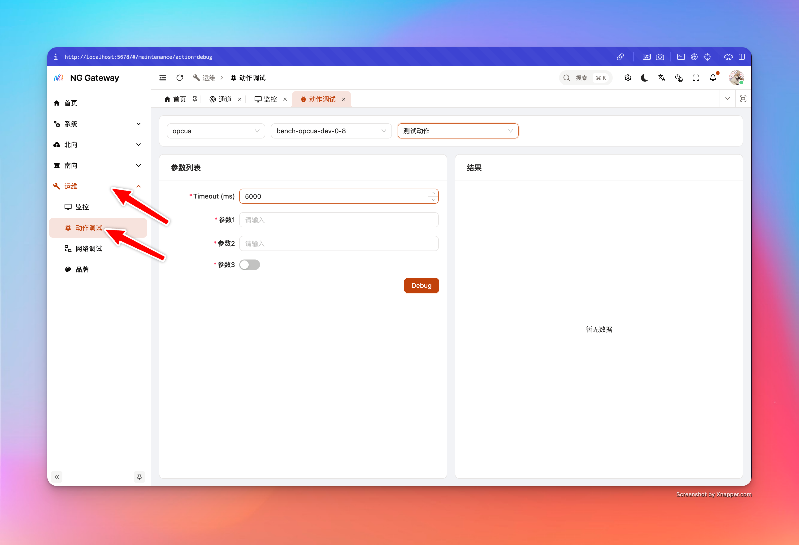
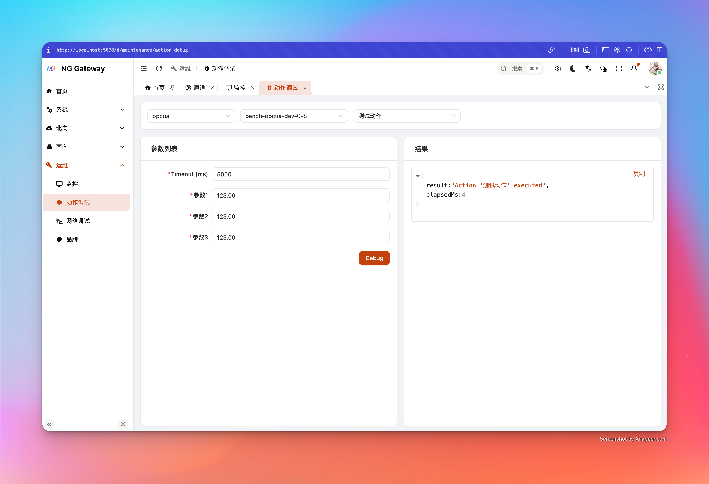

# Action 调试

“Action 调试”用于对某个设备的 **Action（下行/指令/写入/控制动作）** 做一次“可控、可观测”的在线调试：你选择通道与设备、选择 Action，系统会根据 Action 的输入定义动态生成表单，提交后展示结构化返回结果与耗时。

## 适用场景

- **指令联调**：验证设备写入/控制是否可达、参数编码是否正确、驱动是否按预期执行
- **回归验证**：驱动升级/参数变更后，用同一组 Action 参数快速回归
- **现场排障**：确认失败是“设备不在线/链路不通/参数非法/超时”中的哪一类

## 风险提示

Action 往往是“有副作用”的：它可能导致设备启停、写寄存器、开关闸、复位等。

- **生产环境建议使用最小影响动作**：优先选“只读/探测类”动作做连通性验证
- **对关键动作设置更短 TTL 日志与更严格权限**：避免误操作与日志风暴
- **明确超时语义**：超时不等于设备未执行，有可能是“设备执行了但回包慢/回包丢失”

## 前置条件与权限

- 需要登录并具备相应资源权限（通道/设备读取、Action 读取与调试执行权限）
- 目标设备需要已创建 Action 定义，并且驱动支持该 Action 的执行路径

## 使用指南

1. **选择通道（Channel）**
   - 用于加载该通道下的设备列表
2. **选择设备（Device）**
   - 用于加载该设备关联的 Action 列表
3. **选择 Action**
   - 选择后会初始化参数表单（不做额外 loading 骨架，切换更快）
4. **填写参数并执行**
   - 点击“测试/执行”（UI 文案：`page.southward.action.test`）
   - 右侧展示 JSON 结果

## 参数表单的“类型规则”

Action 调试会根据 Action 的输入参数定义渲染组件，关键规则如下：

- **逻辑类型优先**：如果参数有 `transformDataType`，则 UI 使用它作为“用户可理解”的逻辑类型；否则使用原始 `dataType`
- **Boolean**：渲染为开关 `Switch`
- **数字类型**：
  - 整数（含 Timestamp）渲染为 `InputNumber`，步进为 1
  - 浮点（Float32/Float64）渲染为 `InputNumber`，步进为 0.01
  - 若参数定义了 `minValue/maxValue`，表单会同步设置输入范围
- **其他类型**：默认渲染为文本输入 `Input`

内置参数：

- **timeoutMs**：调试请求超时（默认 5000ms）。这是“本次调试调用”的超时，不等同于设备侧真实执行时长。

## 返回结果说明

调试接口返回：

- **result**：驱动/执行器返回的结构化结果（JSON）
- **elapsedMs**：网关侧耗时（毫秒）

UI 会以 JSON 形式展示，支持复制。

## 最佳实践

- **先用最短路径验证连通性**
  - 先用一个“轻量动作”（例如读版本号/读状态）验证设备链路
  - 再执行“有副作用动作”
- **超时设置遵循“两段式”**
  - 首次联调用较短超时（例如 3~5s）快速得到失败反馈
  - 确认设备确实需要更长时间后，再逐步增加超时（避免把“设备不通”误当作“只是慢”）
- **配合临时日志级别（TTL）**
  - 只在需要时把目标 **Channel/App 的日志级别临时调高**（例如 DEBUG 5 分钟）
  - 到期自动回滚，控制成本（详见 [`配置管理`](./configuration.md)）

## 常见问题（FAQ）

### 1) Action 列表为空

- 该设备尚未配置 Action
- 设备不在该通道下（检查通道/设备选择是否正确）
- 权限不足导致列表被过滤（检查 RBAC）

### 2) 执行后返回超时

- 设备不在线或链路不通
- 设备执行耗时超过 `timeoutMs`
- 下行协议本身是“无响应语义”（执行成功但不回包）

建议：

- 先用“网络调试”验证目标地址/端口可达（见 [`网络调试`](./net-debug.md)）
- 临时把目标 Channel 日志调到 DEBUG，观察驱动下行与重试信息（见 [`配置管理`](./configuration.md)）

### 3) 返回结果里有错误信息但我看不懂

- 复制 JSON 结果并结合日志一起分析
- 如果是协议类错误，通常需要核对参数范围、地址、数据类型映射
