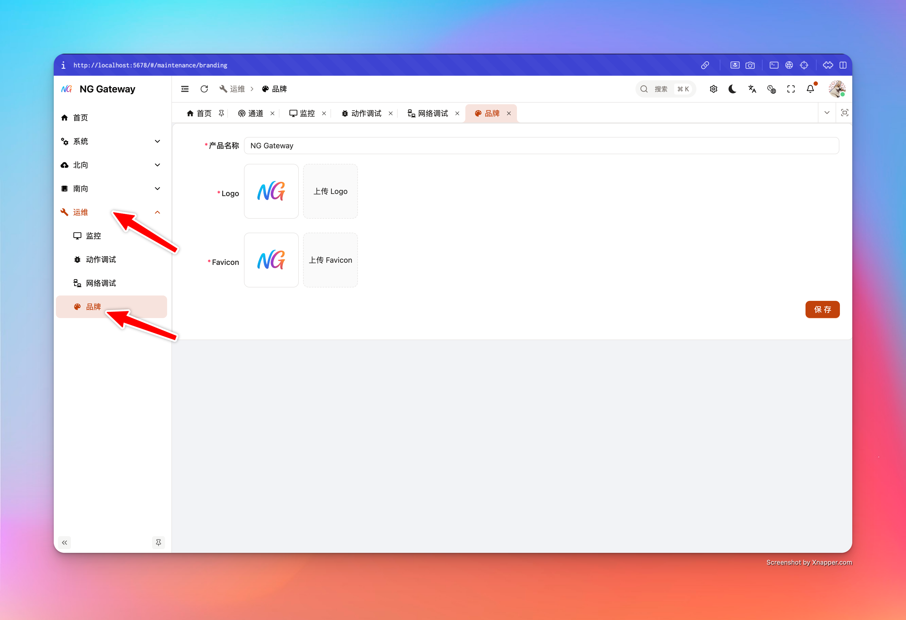

# 白标

“白标”用于将管理控制台替换为你的品牌形象，包括 **产品名称（标题）**、**Logo** 与 **Favicon**。该配置是**全局生效**的：影响所有用户（包括登录页等未认证页面）。

## 权限与影响范围

- **仅系统管理员可修改（SYSTEM_ADMIN）**
- 修改后对所有用户立刻生效（浏览器缓存可能导致视觉更新稍有延迟）

## 可配置项与限制

### 1) 产品名称（Title）

- 必填
- 服务端限制长度：1~128
- 保存后：
  - 会更新浏览器标签页标题（`document.title`）
  - 会同步更新运行时偏好设置（避免刷新后回退）

### 2) Logo

- 支持格式：PNG / WEBP / JPEG
- 最大大小：**10MB**
- 上传后通过 `/branding/logo` 对外提供，并带 ETag（浏览器可能缓存）

### 3) Favicon

- 支持格式：ICO / PNG
- 最大大小：**256KB**
- 对外路径：`/branding/favicon.ico`（同时兼容 `/favicon.ico`）
- 浏览器对 favicon 缓存通常更激进，服务端会强制 `no-cache` 以要求重新校验

## 使用指南

1. 进入“白标”页面
2. 填写 **产品名称**
3. 选择并上传 **Logo** 与 **Favicon**
   - 选择文件时会做类型检查与大小检查；不符合要求的文件会被拒绝
4. 点击“保存”
   - 保存时才会真正发起上传（不会在选择文件时自动上传）
5. 保存成功后，页面会自动刷新预览
   - 系统会从 `/branding.json` 拉取最新配置，并用 `updatedAt` 做 cache bust

## 缓存与刷新策略

白标涉及静态资源（图片/图标），浏览器与代理层可能缓存。系统已做了两类对抗：

- **`/branding.json`**：`Cache-Control: no-cache`（每次都要求重新验证）
- **Logo**：`Cache-Control: public, max-age=3600` + ETag（允许缓存，但通过 `updatedAt` 触发 URL 变化）
- **Favicon**：`Cache-Control: no-cache` + ETag（要求重新验证）

如果你仍然遇到“保存成功但 UI 没变”，按以下顺序处理：

1. **等待 5~10 秒再看**（反向代理/缓存层可能存在延迟）
2. **硬刷新**（Chrome/Edge：Ctrl/Cmd+Shift+R）
3. **清理站点缓存**（仅对该域名）
4. 若使用了 CDN/反向代理，请确认没有对 `/branding/*` 做强缓存

## 常见问题（FAQ）

### 1) 上传提示类型不支持

- Logo 仅允许：`image/png`、`image/webp`、`image/jpeg`
- Favicon 仅允许：`image/x-icon`、`image/vnd.microsoft.icon`、`image/png`

建议用标准工具重新导出文件，避免 MIME 识别异常。

### 2) 上传提示文件过大

- Logo 上限 10MB
- Favicon 上限 256KB

建议：

- Logo 优先使用 SVG 转 PNG、或压缩 PNG/WEBP
- Favicon 使用 32x32 或 48x48 的 ICO/PNG 并开启压缩
