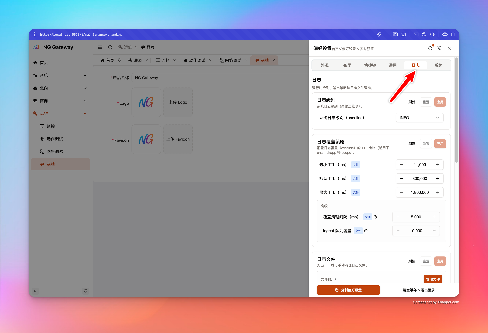
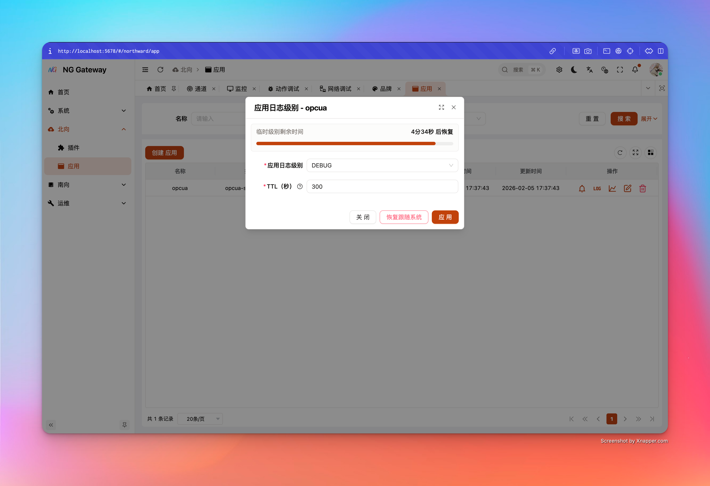
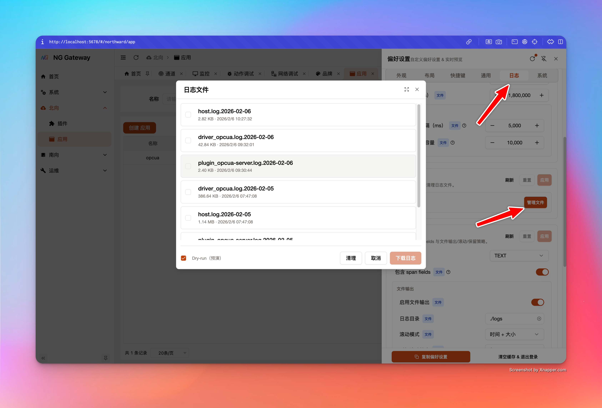

# 配置管理

本页覆盖两类“可运维、可治理”的关键能力：

- **系统配置（Runtime Tuning）**：在不重启进程的前提下调整 Collector/Southward/Northward 的运行参数（并可持久化到配置文件）
- **日志系统（Logging）**：全局日志级别、临时日志级别覆盖（per-channel/per-app，带 TTL 自动回滚）、日志输出格式与落盘策略、文件下载与清理

## 0. 重要设计

每个可调配置项都带有“来源”信息：

- **Default**：系统默认值
- **File**：来自配置文件（如 `gateway.toml`）
- **Env**：来自环境变量（例如 `NG__GENERAL__COLLECTOR__COLLECTION_TIMEOUT_MS`）

当字段被环境变量覆盖时：

- UI 会显示对应 env key（`envKey`），并将该字段置为只读（`envOverridden=true`）
- 这属于**强约束**：避免出现“UI 看起来改了，但实际运行仍被 Env 覆盖”的错觉

最佳实践：

- **K8s/容器化**：用 Env 做“环境级基线”，用 UI 做“临时调参/验证”，并在变更确认后回写到 values/config
- **裸机/边缘网关**：优先使用配置文件作为单一事实来源，Env 仅用于敏感信息或临时覆盖

## 1. 系统配置

系统配置页聚焦“会影响吞吐/延迟/背压”的核心参数。每次 PATCH 都会返回 `ApplySystemSettingsResult`，明确告诉你：

- 是否已应用（applied）
- 是否已持久化（persisted）
- 哪些 key 发生变更（changedKeys）
- 哪些 key 因 Env 覆盖被阻止（blockedByEnv）
- 是否有运行时 warning（runtimeWarning）
- 影响语义（impact）：热更新/需重启组件/需重启进程

> 服务端做了并发保护：系统设置 PATCH 会串行化，但不会阻塞其他 API（避免 UI “整站卡死”）。

### 1.1 Collector（采集引擎）

接口：

- `GET /api/system/settings/collector`
- `PATCH /api/system/settings/collector`

关键字段：

- **collectionTimeoutMs**：单设备采集超时（ms）
  - 太小：容易误判超时、错误率升高
  - 太大：慢设备会占用并发槽位，拖慢整体吞吐
- **maxConcurrentCollections**：最大并发采集数
  - 提升吞吐的主要杠杆，但会增加 CPU/网络/驱动并发压力
- **outboundQueueCapacity**：Collector → Gateway 的有界队列容量
  - 太小：容易背压或 drops（视 drop 策略）
  - 太大：占用更多内存，且“堆积”会掩盖下游变慢
- **retryPolicy**：重试与退避策略
  - `maxAttempts=null` 表示不限制次数（需谨慎）
  - `maxElapsedTimeMs=null` 表示不限制耗时（需谨慎）

建议调参流程：

1. 先观察 Metrics（吞吐、队列深度、错误率）
2. 小步调整并观察 5~15 分钟
3. 若出现 `runtimeWarning`，按提示判断是否需要重启相关组件

### 1.2 Southward（南向运行时）

接口：

- `GET /api/system/settings/southward`
- `PATCH /api/system/settings/southward`

关键字段（高频影响项）：

- **startTimeoutMs**：API 同步启动等待超时（驱动连接等待）
- **deviceChangeCacheTtlMs**：点位变更基线缓存 TTL（`0` 表示不淘汰）
  - TTL 太短：更容易触发“变化判断”的抖动
  - TTL 太长/不淘汰：更占内存，且变更基线可能过旧
- **snapshotGcIntervalMs / snapshotGcWorkers / maxDevicesPerSnapshotTick**
  - 控制快照 GC 扫描节奏与并发
  - 过于激进会增加 CPU；过于保守会导致内存回收不及时

### 1.3 Northward（北向运行时）

接口：

- `GET /api/system/settings/northward`
- `PATCH /api/system/settings/northward`

关键字段：

- **queueCapacity**：北向内部队列容量
  - 直接影响北向背压与缓冲能力
- **startTimeoutMs**：API 同步启动等待超时（app 启动等待）

## 2. 日志系统（Logging）

日志系统建议用“治理视角”理解，而不是“把级别调到 DEBUG 直到能看见”。

这里有三层能力：

- **(A) 全局基线日志级别**：长期有效（baseline）
- **(B) 临时覆盖（TTL override）**：按 Channel/App 临时调高或调低，自动回滚
- **(C) 输出与文件治理**：格式、落盘、轮转、保留、清理、下载

### 2.1 全局日志级别（baseline）

接口：

- `GET /api/system/settings/logging_runtime`
- `PATCH /api/system/settings/logging_runtime`

关键字段：

- **baseline**：你设置的全局基线级别（UI 可编辑）
- **effective**：当前有效全局级别（可能与 baseline 不同）
  - 当存在其他临时机制或外部控制导致 global effective 不同，UI 会提示差异

建议：

- 生产环境默认 `INFO`（或 `WARN`，视排障需求）
- `TRACE` 仅用于短时间诊断（配合 TTL，避免日志风暴）

### 2.2 临时覆盖：per-channel / per-app 日志级别（TTL）

这是一项**产品级**能力：你可以把“某条通道”或“某个北向 App”临时调到 DEBUG/TRACE 进行排障，系统会在 TTL 到期后自动回滚，避免“永久 DEBUG”带来的性能与磁盘成本。

#### per-channel（Channel 日志级别）

接口（Channel 模块）：

- `GET /api/channel/{id}/log-level`
- `PUT /api/channel/{id}/log-level`（body: `{ level, ttlMs }`）
- `DELETE /api/channel/{id}/log-level`

UI 入口：

- **南向 → 通道（Channel）** 列表 → 右侧操作栏 **“日志级别”**（`mdi:math-log` 图标）
- 弹窗内可设置 level 与 TTL，并展示倒计时进度条；到期会自动刷新为“无覆盖”状态

语义要点：

- TTL 有**统一护栏**：`minMs / maxMs / defaultMs`，用于避免滥用
- 设置覆盖会替换同 scope 的旧覆盖（行为确定性）
- 倒计时到 0 后自动失效并恢复“跟随系统”

#### per-app（Northward App 日志级别）

接口（Northward App 模块）：

- `GET /api/northward-app/{id}/log-level`
- `PUT /api/northward-app/{id}/log-level`
- `DELETE /api/northward-app/{id}/log-level`

UI 入口：

- **北向 → App** 列表 → 右侧操作栏 **“日志级别”**（`mdi:math-log` 图标）
- 交互与 Channel 一致：level + TTL + 倒计时，到期自动回滚

#### 最佳实践：如何用 TTL override 排障

- **只调一个目标**：优先只调一个 channel 或一个 app，避免日志量爆炸
- **先短后长**：默认 5 分钟足够；必要时再延长
- **调试结束立刻恢复**：不要等 TTL 结束（尤其是 TRACE）

### 2.3 TTL 护栏与 ingest 队列（Logging Control）

接口：

- `GET /api/system/settings/logging_control`
- `PATCH /api/system/settings/logging_control`

关键字段：

- **overrideMinTtlMs / overrideDefaultTtlMs / overrideMaxTtlMs**
  - 作用于所有 override scope（Channel/App/未来扩展）
- **overrideCleanupIntervalMs**
  - override 过期扫描间隔（建议不要太小，避免额外开销；服务端下限为 200ms）
- **ingestQueueCapacity**
  - 统一的 `cdylib -> host` 日志 ingest 有界队列容量（driver + plugin）
  - 太小：高峰期更容易出现“新日志进不来/发生丢弃”
  - 太大：占用更多内存，且会放大日志洪峰的缓存

### 2.4 输出与落盘（Logging Output）

接口：

- `GET /api/system/settings/logging_output`
- `PATCH /api/system/settings/logging_output`

可配置项：

- **format**：`text` 或 `json`
- **includeSpanFields**：是否在日志中包含 span 上下文字段（便于排障）
- **file.enabled / file.dir**：是否落盘、日志目录
- **rotation.mode**：`time` / `size` / `both`
- **rotation.time**：`hourly` / `daily`
- **rotation.sizeMb / rotation.maxFiles**
- **retention.maxDays / retention.maxTotalSizeMb**

最佳实践建议：

- 生产推荐开启落盘，并设置合理的 **轮转 + 保留**，避免磁盘写满
- JSON 格式适合日志采集系统（ELK/ClickHouse 等）；TEXT 更适合直接 tail

### 2.5 清理与下载（Logging Files & Cleanup）

接口：

- `GET /api/system/settings/logging_files`：列出日志文件
- `POST /api/system/settings/logging_files/download`：打包下载（ZIP 流式输出）
- `POST /api/system/settings/logging_files/cleanup`：按策略清理（支持 dryRun）
- `GET/PATCH /api/system/settings/logging_cleanup`：清理任务开关与周期

产品级安全点（你可以写进 SOP）：

- 下载接口会对文件名做安全校验，避免路径穿越
- 打包下载使用流式输出，优先减少大文件的内存占用
- 清理支持 **dryRun**：先看“会删什么、释放多少”，再真正删除

## 3. 推荐 SOP

1. 打开 [`数据监控`](./data-monitor.md)，确认设备值是否在变化、最后更新时间是否推进
2. 若怀疑网络问题，先用 [`网络调试`](./net-debug.md)：
   - TCP 端口连通性 → Ping/HTTP
3. 若需要深入驱动/插件链路：
   - 对目标 **Channel 或 App** 设置日志级别 override（DEBUG，TTL=5min）
4. 在 5 分钟窗口内复现问题
5. 下载日志包并回滚覆盖（或等 TTL 自动回滚）
