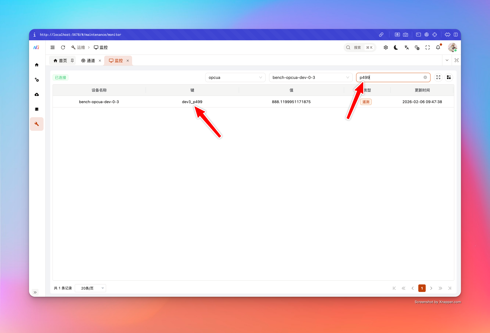

# 数据监控

“数据监控”用于在管理控制台中实时查看某个设备的 **Telemetry** 与 **Attributes（client/shared/server）**，适合现场排障与联调验证：你能快速回答“设备有没有上报”“值有没有变化”“最后更新时间是什么时候”。

## 适用场景

- **现场排障**：设备数据断续、延迟变大、疑似丢数据时，快速确认网关侧是否已采集到最新值
- **联调验证**：驱动/点位映射刚改完，确认 key 是否正确、值是否按预期变化
- **与北向链路解耦**：先确认“采集是否正常”，再去看“上云是否正常”，避免两头同时猜

## Telemetry vs Attributes

- **Telemetry**：通常代表高频采集/上报的时序数据（点位值、传感器数据等）
- **Attributes**：通常代表相对静态或低频变化的属性
  - **client**：由设备/客户端侧上报的属性
  - **shared**：平台侧下发/共享的属性
  - **server**：服务端维护的属性

在监控表格中，`sourceType` 会标识当前行来自 `telemetry` 还是 `attributes`。

## 使用指南

1. **选择通道（Channel）**
   - 该选择用于加载此通道下的设备列表，避免在大量设备中盲选
2. **选择设备（Device）**
   - 选择后会建立 WebSocket 连接并订阅该设备的数据流
3. **按 Key 搜索**
   - 在“搜索框”输入关键字，可按 `key` 进行过滤（大小写不敏感）
4. **查看表格字段**
   - **Device Name**：设备名称
   - **Key**：点位 key / 属性 key
   - **Value**：当前值（可能为对象/数组等复杂 JSON）
   - **Source Type**：`telemetry` 或 `attributes`
   - **Last Update**：该设备最后更新时间（服务端时间戳）

## 刷新语义与性能边界

为了在“高吞吐 + 高频点位”场景仍可稳定使用，监控链路做了两层“限速/合并”：

- **服务端合并（200ms 窗口）**：服务端会把同一设备在短窗口内的点位更新合并后再推送，避免每个点位一帧导致 UI 被淹没
- **前端节流（200ms 最小刷新间隔）**：前端对 UI 更新做了节流，避免表格频繁重绘

此外，表格渲染做了分页优化：

- **仅渲染当前页的值**：分页时只为当前页行“注入实时 value”，将刷新成本控制为 \(O(pageSize)\)，避免点位数量大时浏览器卡顿

## 已知限制与注意事项

- **需要先有“设备快照”**：监控依赖设备在网关侧的最新快照；如果设备从未上报过数据，可能无法展示任何行
  - 建议先确认：设备是否已连接、采集是否已启动、是否有数据上报到网关
- **Attributes 同名 key 的歧义**：同一个 key 可能同时存在于 `client/shared/server`，UI 内部会按 scope 区分行（避免冲突）

## 常见问题（FAQ）

### 1) 连接状态显示“Disconnected/Connecting/Reconnecting”怎么办？

- **先确认 API 网关地址与网络**：浏览器是否能访问网关管理端口
- **检查鉴权状态**：登录是否过期（过期后 WS 可能被拒绝）
- **看浏览器控制台**：若出现 WebSocket 连接被拒绝/401/403，通常是权限或鉴权问题

### 2) 选择了设备但表格一直没有任何数据？

- **设备尚未产生快照**：设备从未成功采集/上报过数据时，监控无法展示 key 列表
- **驱动/通道未启动或连接失败**：先去看通道连接状态与采集状态
- **确认点位模型**：没有配置点位/没有上行输出，也不会出现 telemetry keys

### 3) Value 显示为 `undefined` 或空？

- 该 key 可能存在于“元数据列表”中，但当前快照暂未包含值（例如刚新增 key、尚未上报）
- 建议等待下一次设备上报或重新订阅（切换设备再切回）

## 故障排查建议

- **先看指标与背压**：如果队列背压或 drops 明显，实时监控也可能出现延迟
- **再分方向**：南向采集是否正常？北向上报是否正常？

