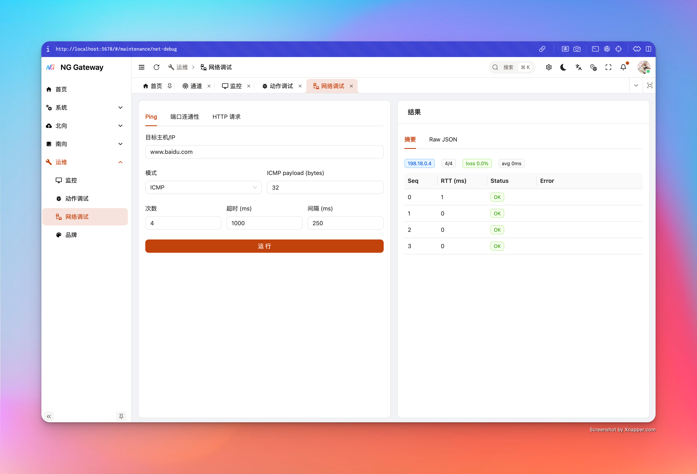
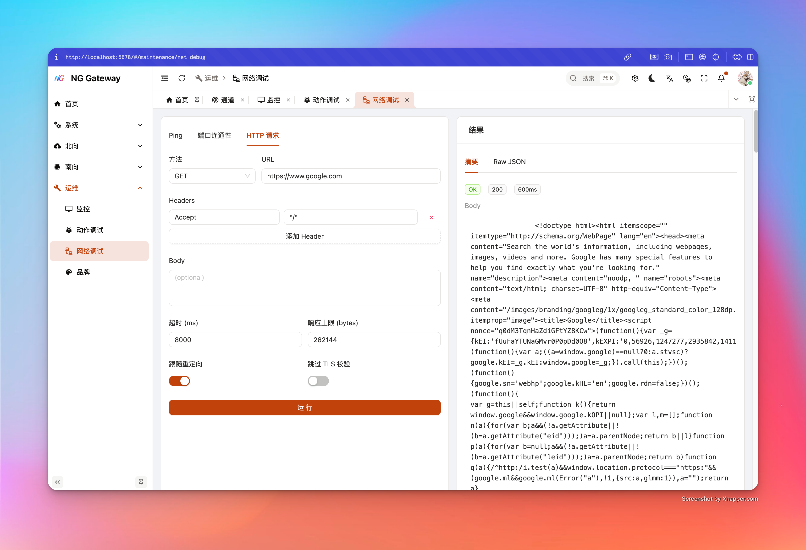

# 网络调试

“网络调试”提供三类内置诊断能力：**Ping**、**TCP Connect**、**HTTP Request**。它们都由网关使用库函数实现，不执行任何 shell 命令，避免命令注入风险，并且包含最小 SSRF 防护（避免把网关变成内网扫描器）。

## 1) Ping（ICMP / TCP）

### 能解决什么问题

- 目标域名是否能解析到 IP（返回 `resolvedIps`）
- 基础网络是否可达（丢包率、RTT）
- ICMP 不可用时，可用 TCP mode 近似验证路径可达

### 参数说明

- **Target Host**：域名或 IP
- **Mode**
  - `icmp`：ICMP echo
  - `tcp`：对 `tcpPort` 做 TCP connect（用于没有 ICMP 权限的环境）
- **ICMP payload (bytes)**：ICMP 负载大小（8~1024）
- **Count**：次数（1~20）
- **Timeout (ms)**：单次超时（100~30000）
- **Interval (ms)**：间隔（0~10000）

### 返回结果

- `targetIp`：本次使用的目标 IP（从解析结果中选取）
- `received/sent` 与 `lossPercent`
- `rttAvgMs`（若有成功样本）
- `samples[]`：每个序号的 OK/FAIL 与 RTT/错误
- `note`：当检测到常见权限问题（例如容器缺少 `CAP_NET_RAW`）时会给出提示

### 常见问题

- **ICMP 全失败且错误包含 Permission**：常见于容器/受限环境缺少 raw socket 权限
  - 解决：改用 **TCP mode**，或为容器授予 `CAP_NET_RAW`（需评估安全风险）

## 2) TCP Connect（端口连通性 + Banner）

### 能解决什么问题

- 目标主机:端口是否可建立 TCP 连接
- 基础握手耗时（`connectMs`）
- 可选读取 Banner（例如某些服务会返回欢迎信息/协议头）

### 参数说明

- **Host**：域名或 IP
- **Port**：端口（1~65535）
- **Timeout (ms)**：连接超时（100~60000）
- **Read Banner**：是否尝试读取 Banner
- **Banner Bytes**：读取字节数上限（1~4096）

### 返回结果

- `connected`：是否连接成功
- `targetIp`：最终成功的 IP（若解析到多个会逐个尝试）
- `connectMs`：连接耗时
- `banner`：读到的文本（若有）
- `error`：失败原因（超时/拒绝/无法路由等）

## 3) HTTP Request（应用层诊断）

### 能解决什么问题

- 网关到目标 HTTP(S) 服务是否可达
- 状态码、响应头、响应 body（截断保护）
- 重定向行为、TLS 证书问题（可选放宽）

### 参数说明

- **Method**：GET/POST/PUT/PATCH/DELETE/HEAD/OPTIONS
- **URL**：仅允许 `http://` 或 `https://`
- **Headers**：可添加多组 header（空 key 会被忽略）
- **Body**：可选请求体（注意：某些服务对 GET/HEAD body 行为不一致）
- **Timeout (ms)**：200~120000
- **Max Response Bytes**：响应体上限（1KB~2MB），超出会截断并标记 `bodyTruncated=true`
- **Follow Redirects**：是否跟随重定向（最多 5 次）
- **Insecure TLS**：是否接受无效证书（仅用于临时诊断，生产不推荐）

### 返回结果

- `status`：HTTP 状态码（失败时可能为空）
- `totalMs`：总耗时
- `headers`：响应头 map
- `body`：响应 body（可能为空）
- `bodyTruncated`：是否发生截断
- `error`：错误信息（DNS/TLS/超时/连接失败等）

